# User Manual

This manual describes how the _cabinet_ application can be used for administering student records. It focuses on the user's perspective but is also suitable for technical staff responsible for implementing the application in their university's technological landscape to learn about the user interface and functionalities of _cabinet_.

## User Flows

### Search for documents or persons based on common values

Using various combinations of filters and search strings, users are able to find documents or persons that match the desired criteria. The filters can be configured (by selecting the button _Configuration_) to show only the needed categories.

!!! tip

    Activating fewer filters makes the search faster than having all filters active.

<figure markdown>
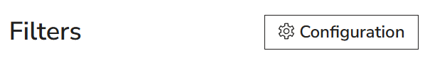{: style="max-width:800px; width: 100%; box-shadow: 0px 0px 5px #888;" }
</figure>

### Search for a specific person

Using the search bar, users can type in any of the following data values of a person into the search bar: name, last name, matriculation number, CAMPUSonline identification number, and birthdate. It is useful to know the following features:

- The search is dynamically applied and adapted after each typed-in character.
- Strings that contain diacritics are even being matched using their non-diacritic equivalents. For example, a search for _Hodzic_ equally matches _Hodžić_ as well.
- For searching the person's name and the document type, the search uses a typo tolerance algorithm when there is no exact search match. In other words, typographical mistakes or minor uncertainty still lead to results.
- When multiple persons match the entered string, users can either limit the search results by selecting filters, or if they identify the desired person in the results, use the button _Focus_, which excludes all other persons from the search results.

<figure markdown>
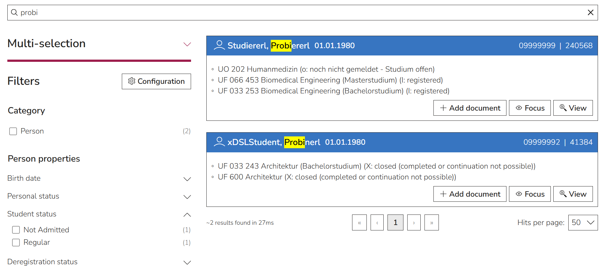{: style="max-width:800px; width: 100%; box-shadow: 0px 0px 5px #888;" }
</figure>

- The search string could match not only persons, but also documents. In this case, users can use the filter _Category_ to select only persons or only documents.

### Apply actions to a person

The source of personal data in _cabinet_ is CAMPUSonline. Therefore, editing a person's data directly in _cabinet_ is not possible. However, the person's view modal contains a direct link to the CAMPUSonline profile (i.e., the button _Edit data in …_), where data can be edited. This data adjustment automatically gets updated in _cabinet_ after closing the CAMPUSonline window.

Personal data gets automatically synchronized with CAMPUSonline on a regular basis every 10 minutes, as well as after editing in CAMPUSonline, when the browser tab of CAMPUSonline gets closed. It can also be triggered manually for a selected person by selecting the _Synchronize data_ button.

It is also possible to export a person's data as a PDF using the button Download.

<figure markdown>
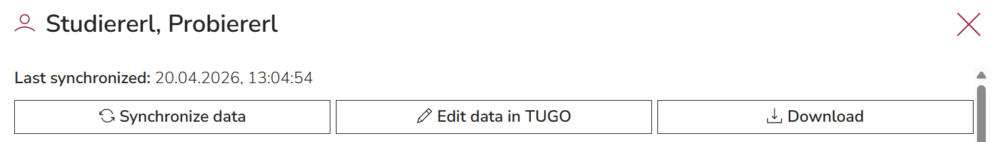{: style="max-width:800px; width: 100%; box-shadow: 0px 0px 5px #888;" }
</figure>

Another important feature is to add documents to persons, which is described in the user flow [Add a document to a person](#add-a-document-to-a-person).

### Export data of multiple persons at once

The _cabinet_ user interface allows exporting the data of multiple persons at once.

For this, one first needs to open the _Multi-selection tool_ and use it to select the needed persons. The best way to do this is in combination with the search bar and filters.

<figure markdown>
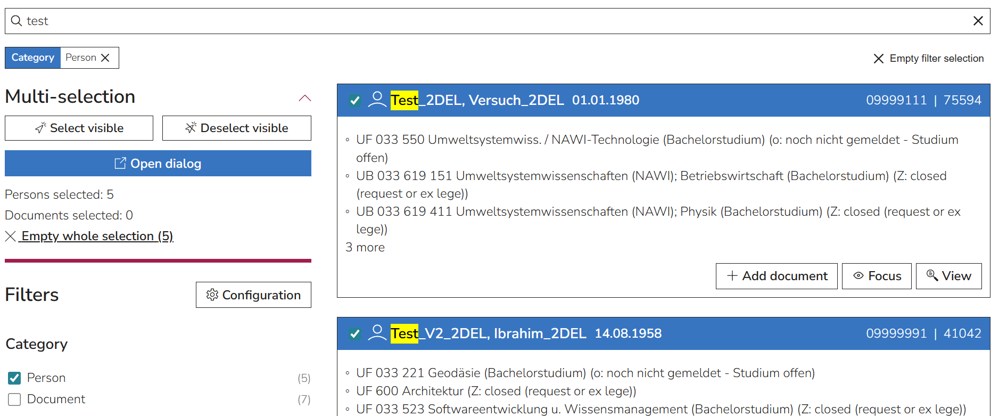{: style="max-width:800px; width: 100%; box-shadow: 0px 0px 5px #888;" }
</figure>

The _Open dialogue_ button then opens the multi-actions tool for persons and for documents. In the tab _Persons_, one can configure which data should be shown and use the _Export_ functionality to export the configured data table as CSV or Excel or to download PDFs of the persons' data of all selected persons.

<figure markdown>
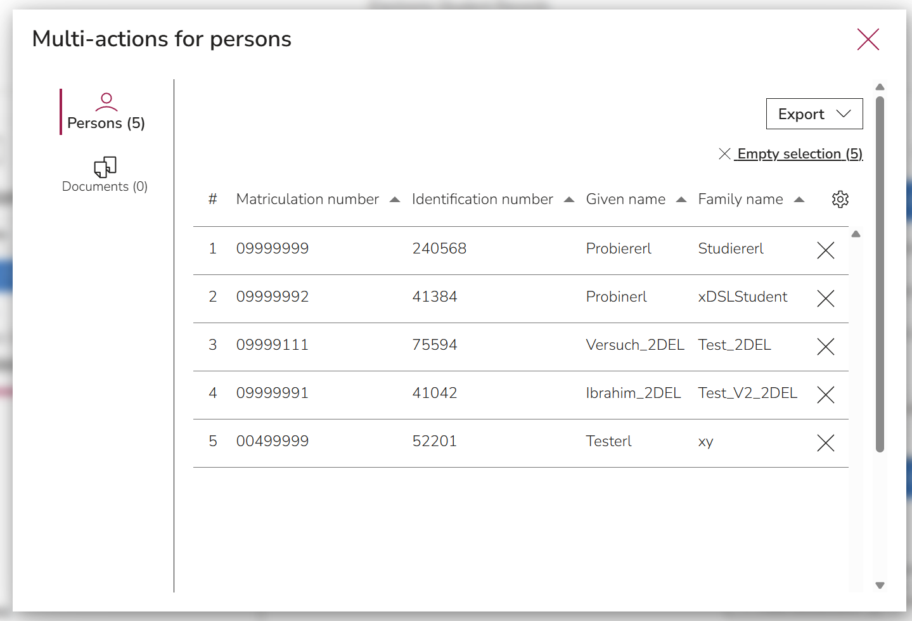{: style="max-width:800px; width: 100%; box-shadow: 0px 0px 5px #888;" }
</figure>

### Add a document to a person

To manually add a document to a person, users first need to search for that person, as described above. Using the button _Add document_, a document can be added by uploading it from the personal computer, from the cloud, or from the application clipboard.

<figure markdown>
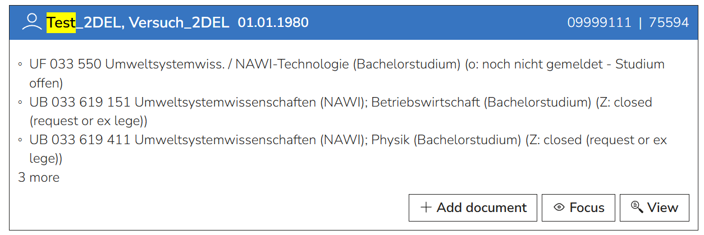{: style="max-width:800px; width: 100%; box-shadow: 0px 0px 5px #888;" }
</figure>

!!! important

    It is important to note that PDF/A (conformance level 2b, 1b, 1a, 2u, and 2a) is the only acceptable file upload format.

The system validates the conformity on upload and rejects non-PDF/A formats in order to ensure long-term preservation. Documents in other formats need to be converted to PDF/A first. This is possible using Adobe Acrobat, even with multiple files at once. For detailed instructions, please visit [Adobe Acrobat](https://www.adobe.com/acrobat/hub/how-to-convert-pdf-to-pdfa.html) or read our chapter [How to create and validate PDF/A files]((#how-to-create-and-validate-pdfa-files).

After uploading the file, the user needs to assign a document type (for example, _Personal licence_). Depending on the selected type, there are a number of data fields, of which some are required, and others optional. Additionally, the system automatically saves the upload and update time, as well as the name of the person who last modified it.

Unlike documents that need uploading, documents generated in CAMPUSonline are being sent to _cabinet_ automatically upon creation and assigned to the corresponding person. Distinguishing them from manually uploaded documents is possible using the filter Digital document source.

### Search for a specific document

The best way to find a document file in _cabinet_ would be to search for a person first and then use the button _Focus_, which excludes all other persons and their documents from the search results. The listed documents can be further limited by applying filters of either the _Person properties_ or the _Document properties_, or both in combination.

Documents can also be found using the search bar. This can especially be practical if the data field _Registry number_ is filled out consistently, which makes it possible to quickly see all documents that belong to a certain registry case. Other data fields that match the entered search bar string are the person's name, last name, matriculation number, CAMPUSonline identifier, and birthdate, as well as the document type.

<figure markdown>
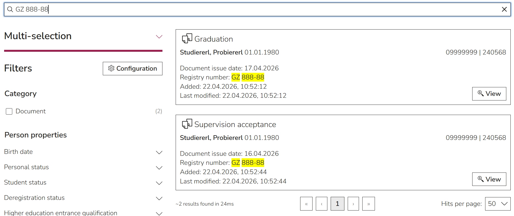{: style="max-width:800px; width: 100%; box-shadow: 0px 0px 5px #888;" }
</figure>

### Apply actions to a document

Once uploaded, documents can be edited, deleted, downloaded, or exchanged between integrated applications.

<figure markdown>
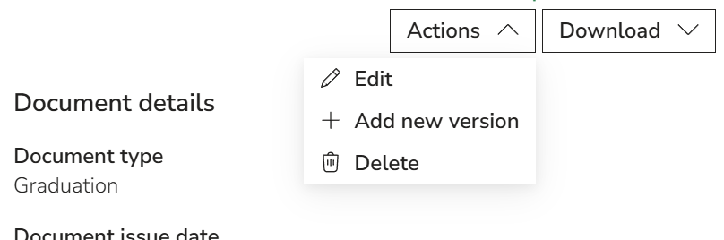{: style="max-width:800px; width: 100%; box-shadow: 0px 0px 5px #888;" }
</figure>

#### Editing

Using the action _Edit_ in the document view, it is possible to edit document data without re-uploading the file itself, but also to re-upload a file without having to re-enter the data.

Editing of data for automatically added documents from CAMPUSonline is only possible for specific data fields, like Registry number and Comment.

#### Adding a new version

_cabinet_ has a flexible concept of versions that can be fully controlled by the user. If a document is added to _cabinet_ in this way instead of using the button _Add document_ in the person's hitbox, that uploaded document will be grouped with the already existing document. To read more about this concept, see the chapter [How the grouping of documents works](#how-the-grouping-of-documents-works).

!!! note

    Grouping documents manually is only necessary and possible for manually uploaded documents. Automatically added documents from CAMPUSonline get grouped automatically depending on the agreed-upon criteria (for example, a mutual document type).

#### Deleting

If documents are selected for deletion, they stay in the database for an additional agreed-on time and can be found by selecting the radio button _Recycle bin_ in the facets. Only after the expired time will they get irrevocably removed.

To read more about the retention periods and deletion, see the chapters [How to treat retention periods](#how-to-treat-retention-periods) and [How deletion works](#how-deletion-works).

#### Downloading

For downloading the document, users can decide if they want to apply the action to the uploaded file, the added metadata in JSON format, or both in a ZIP directory.

Using the same _Download_ button, it is possible to transfer documents between _cabinet_ and other digital blueprint applications, if they are integrated in _cabinet_ as activities (i.e., if you can find them under the _Menu_). This can be done by choosing _Clipboard_ as the targeted download location. After this is applied, users can open the desired activity (for example, [eSign](../esign.md) for electronically signing documents) and continue by uploading the same file from the _Clipboard_.

<figure markdown>
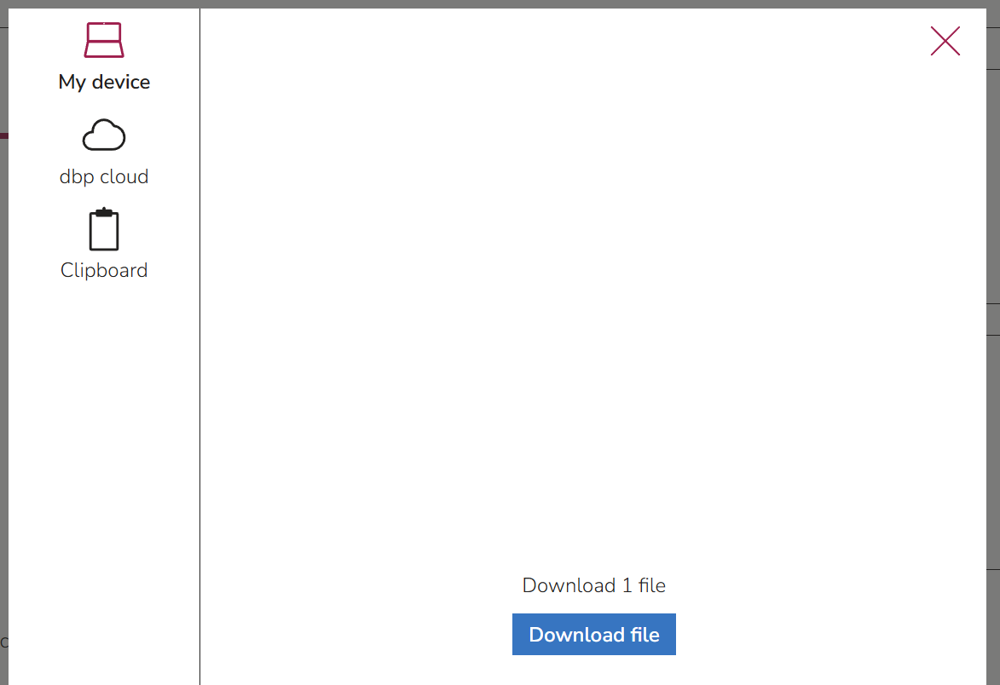{: style="max-width:800px; width: 100%; box-shadow: 0px 0px 5px #888;" }
</figure>

### Apply actions to multiple documents

The _cabinet_ user interface allows exporting and deleting multiple documents at once.

For this, one first needs to open the _Multi-selection_ tool and use it to select the needed documents. The best way to do this is in combination with the search bar and filters.

!!! tip

    To select some obsolete document versions, one should make sure to check the _Include obsolete versions_ box in the filters. To select some deleted documents, one can switch the filter from _All active documents_ to _Recycle bin_.

The _Open dialogue_ button then opens the multi-actions tool for persons and for documents. In the tab _Documents_, one can configure which data should be shown and use the _Export_ functionality to export the configured data table as CSV or Excel or to download PDF files of the documents with or without the JSON metadata.

<figure markdown>
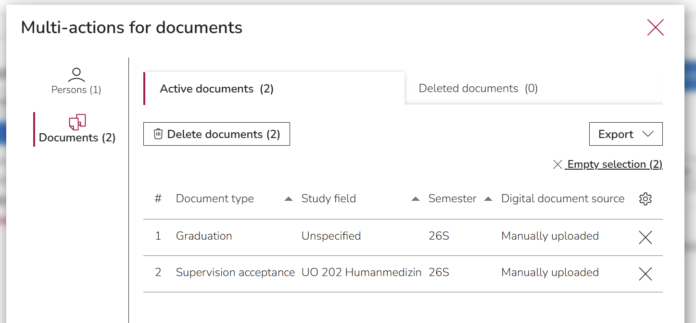{: style="max-width:800px; width: 100%; box-shadow: 0px 0px 5px #888;" }
</figure>

To remove selected documents individually, the _X_ button can be used. The complete selection can be cleared using the _Empty selection_ button.

To instead delete the selected documents, the _Delete documents_ button can be used. Deleted documents will be displayed in a separate section of the multi-actions dialogue.

## FAQ

### How to create and validate PDF/A files

To guarantee the long-term preservation of a document, _cabinet_ only accepts files in PDF/A format. PDF/A is a specialized version of PDF suitable for archiving electronic documents. Files in a PDF/A format can have different conformance levels. The required conformity level in _cabinet_ is 2b, but the more restrictive formats (1a, 1b, 2a, and 2u) are also accepted.

To ensure this, _cabinet_ validates the uploaded file using the verity bundle with the integrated veraPDF validation tool. One can also validate a file without uploading it to _cabinet_ by visiting [Vera PDF](https://demo.verapdf.org/).

There are multiple ways to create a compatible PDF/A file.

**Scan a document as PDF/A**

Some scanners make it possible to scan a document as PDF/A. For this, check the user manual of your scanner.

**Adobe Acrobat**

If your document is already in an electronic form, you can convert it into PDF/A using Adobe Acrobat. To do this, open the file in Acrobat, and go to _All Tools_ -> _Apply PDF Standards_ -> _Save as PDF/A_. In the newly opened window, select _Settings_ and choose a suitable PDF/A conformance level.

To do this process with multiple files at once, use the _Action Wizard_ in _Acrobat_ by following the official _Adobe_ [instructions](https://www.adobe.com/acrobat/hub/how-to-batch-convert-to-pdf.html).

**LibreOffice Writer**

To create a PDF/A using LibreOffice Writer, go to _File_ -> _Export as ..._ -> _Export as PDF_. In the newly opened window, go to the _General_ tab and find the section _General_. There you can select the suitable PDF/A version.

**OnlyOffice**

Go to _File_ -> _Save as ..._ and in the newly opened window, select the suitable PDF/A version from the dropdown.

**img2pdf tool**

PDF/A can even be created out of an image using the img2pdf tool. This tool is available in the command line under Linux as well as Windows, but also as a [Python package](https://pypi.org/project/img2pdf/).

### How the data synchronization with CAMPUSonline works

The _cabinet_ application contains two sources of data. On one side, there is data added directly and manually by the _cabinet_ user. These are uploaded PDF/A files and the data that is added to those files. On the other side, there is data that gets synchronized from CAMPUSonline. These are the persons' information, PDF/A files generated by CAMPUSonline, and metadata of those files.

!!! note

    Currently, all active students and those who had an active account in the university’s CAMPUSonline instance in the past are transferred to cabinet. Data of applicants is currently not contained in cabinet.

The communication between _cabinet_ and CAMPUSonline happens via API connectors. This is further described in the [Administration guide](./admin-manual.md).

The data only gets synchronized in one direction: from CAMPUSonline to cabinet. This happens automatically every 10 minutes or manually per person by selecting the button _Synchronize data_. To ensure a quick transition between the applications, the CAMPUSonline profile of the person is linked via the button _Edit data in …_. This way, users can access the respective profile, which opens in a new browser tab. After users edit the data and close the CAMPUSonline tab, the new data gets automatically updated in cabinet.

### Which formats and data standards are used

To ensure long-term preservation, as well as possible adjustments to future technical developments, _cabinet_ sticks to standardized file and data formats.

Uploading files is only possible in the PDF/A (conformance level 2b, 1b, 1a, 2u, and 2a) format. To convert a document to the fitting format, see the chapter [How to create and validate PDF/A files](#how-to-create-and-validate-pdfa-files).

Each uploaded file automatically gets assigned system-defined metadata, such as upload time, modification time, and name of the person of the last modification. Additionally, users are required to fill out data as required for the selected document type, such as issue date, assignment to study field, or purpose of storage. All the system- and user-defined data is validated with JSON Schema and stored in the JSON format. Even though the data from _cabinet_ is not meant to be exchanged with external systems and services, the vocabulary of the JSON files is mainly based on [schema.org](https://schema.org/), a widely used vocabulary for structured data. However, since students' data can be quite specific, this was not possible for all data attributes. To still ensure data usage transparency, all data fields are described in the JSON Schema files.

### How the grouping of documents works

In cabinet, manually uploading documents using the _Add new version_ option in the view of an already existing document adds this document to the same group as that already existing document by assigning it the same group ID. This grouping is then evident in the _Select version_ dropdown in the document view, as well as in the search activity, if _Include obsolete versions_ was selected in the facets.

<figure markdown>
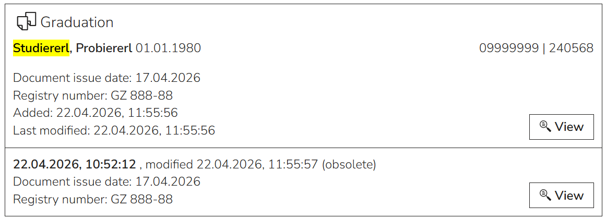{: style="max-width:800px; width: 100%; box-shadow: 0px 0px 5px #888;" }
</figure>

When a _new version_ is added, it gets marked as the current version, and the previous one gets marked as obsolete. This can also be changed manually. If multiple documents are marked as current, the user gets informed with a status indicator and can set actions to repair that problem.

<figure markdown>
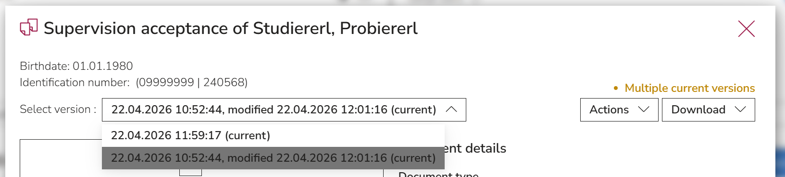{: style="max-width:800px; width: 100%; box-shadow: 0px 0px 5px #888;" }
</figure>

The criteria for grouping documents can freely be decided by your organization. We recommend an internal agreement with all employees and consistent usage of this feature.

For automatically generated documents in CAMPUSonline, the desired grouping criteria can be configured. This way, grouping happens automatically, and no manual actions are needed.

### How to treat retention periods

Retention periods are a way for the user to know, when a document should be deleted or archived. The responsibility for defining those periods and for the deletion or archiving itself is in the hands of the data owner. Therefore, our system does not carry out those actions automatically.

The configuration of _cabinet_ for a university allows the definition of the type of disposal (deletion or archiving) and the duration of storage per document type.

The document view will display the calculated retention period according to the configuration.

The filter options _Only documents to delete_ and _Only documents to archive_ display all documents that have reached the retention date. This makes it easier to find and select documents that require these specific actions, which can then be conducted using the mutli-selection and multi-actions functionalities.

### Why not everything is translated to English

Person data values are stored in CAMPUSonline and only transferred into _cabinet_ in German. Another exception for the translation is manually entered (i.e., user-defined) text string data values. Values that get selected from dropdowns are usually mapped to the respective German and English translations.
