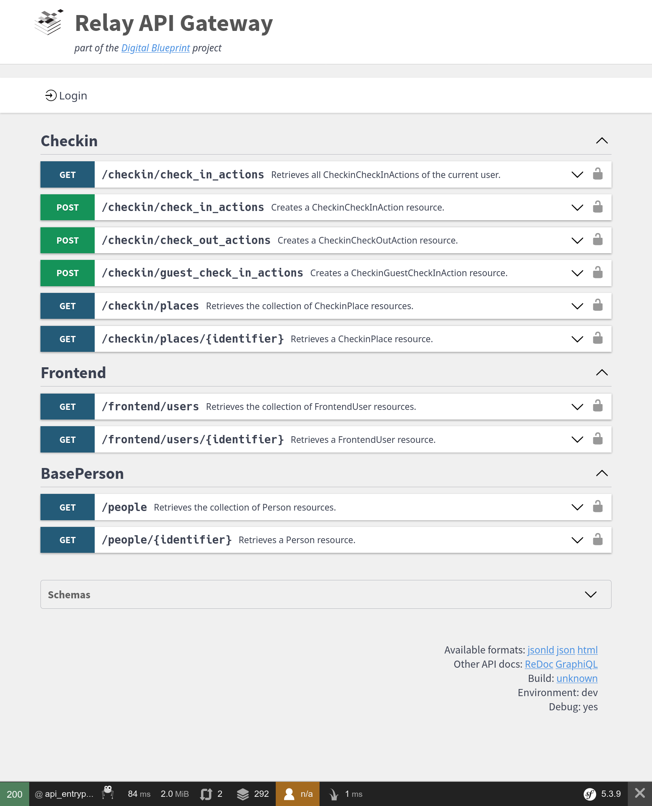

# Check-in

Handles check-ins to places and contact tracing for warning about COVID-19 cases.

[Visit Check-in Demo](https://dbp-demo.tugraz.at/apps/check-in)

## Screenshot

<figure markdown>
{: style="max-width:800px; width: 100%; box-shadow: 0px 0px 5px #888;" }
</figure>

## Example tech stack

- An **LDAP server**, which at least contains first name, last name, e-mail address and user id of the students
- A [**Keycloak**](https://www.keycloak.org/guides) server, which integrates with the LDAP server
- A [**MongoDB**](https://www.mongodb.com/) server for CampusQR
- A **LAMP server** (Linux, Apache, MySQL/MariaDB, PHP>=7.3)
  - The dependency manager for PHP [Composer 2](https://getcomposer.org/) also needs to be installed
  - `git` >= 2.25 needs to be installed
  - In case that the frontend will also be hosted on the same server, then **npm** needs to be installed too
  - Several **PHP extensions** need to be present: `ext-ctype`, `ext-dom`, `ext-fileinfo`, `ext-filter`, `ext-json`,
    `ext-ldap`, `ext-libxml`, `ext-mbstring`, `ext-openssl`, `ext-pcre`, `ext-reflection`, `ext-simplexml`, `ext-soap`,
    `ext-spl`, `ext-tokenizer`, `ext-xml`, `ext-mysql`, `ext-curl`, `ext-gmp`
- **Domains** (or sub-domains) along with the needed **TLS/SSL certificates** for the Relay API web server,
  the frontend web server, the CampusQR server and the Keycloak server
-  A reverse proxy with ssl-termination for CampusQR
- **Java** JVM >= 11 (LTS)

## Installation

```{.mermaid style="max-width:600px; margin: auto"}
graph TB
    frontend(Check-in App)-->relay(Relay API)
    frontend-->keycloak[Keycloak Server]
    relay-->check-in-bundle[[Check-in Bundle]]
    relay-->frontend-bundle[[Frontend Bundle]]
    relay-->auth-bundle[[Auth Bundle]]
    check-in-bundle-->campus-qr[CampusQR]
    campus-qr-->mongodb[MongoDB]
    check-in-bundle-->base-person-bundle[[Base Person Bundle]]
    check-in-bundle-->core-bundle[[Core Bundle]]
    frontend-bundle-->core-bundle
    core-bundle-->mysql[MySQL]
    auth-bundle-->local-system("University systems (e.g. LDAP)")
    auth-bundle-->keycloak
    keycloak-->local-system

    style frontend fill:#d0d0ff,stroke:#333,stroke-width:4px
```

### Frontend App

You can install the frontend application with a simple command you can find on
[Check-in frontend installation](https://github.com/digital-blueprint/checkin-app#using-this-app-as-pre-built-package).

To install the frontend app you need `npx` which should be installed using this command.

```bash
# Install nodejs packages on Debian/Ubuntu
apt-get -y --no-install-recommends install nodejs
```

After installing the frontend app you need to adapt the `index.html` file to match the branding of your organization. You can find a guide for this in the [Handbook](../frameworks/frontend/theming.md).

### Keycloak Server

You need to install and set up the Open Source Identity and Access Management [Keycloak](https://www.keycloak.org/),
which needs to import (sync) your LDAP users.

!!! tip
    There is small guide about the [Keycloak Client Setup](../frameworks/frontend/keycloak_integration.md).


In addition to the `dbp-frontend` default client scope Check-in also needs a second default client scope called `location-check-in`, where `Include in Token Scope` is enabled and no additional mappers or scopes are set.

### MongoDB

You need to install and set up the open source document database system [MongoDB](https://www.mongodb.com/),
that is used by CampusQR as backend.

* Install MongoDB: <https://docs.mongodb.com/manual/administration/install-on-linux/>
* Add an admin account: <https://docs.mongodb.com/manual/tutorial/configure-scram-client-authentication/>

If your database is on a separate server, you will additionally need to install at least a mongodb client on the server that is running CampusQR to enable CampusQR to configure the database.

!!! tip
    If you dont want to add an admin account, an normal user with the `readWrite` role _should_ work too. Guides on how to [manage users](https://www.mongodb.com/docs/manual/tutorial/manage-users-and-roles/), on [MongoDB privileges](https://www.mongodb.com/docs/manual/reference/privilege-actions/) and [built-in roles](https://www.mongodb.com/docs/manual/reference/built-in-roles/) are linked respectively. However, this was not tested exhaustively and thus may lead to unexpected problems.

### CampusQR

You need to install and set up the **digital blueprint** fork of [CampusQR](https://gitlab.tugraz.at/dbp/check-in/campus-qr),
the open source system for contact tracing at universities.

* Download the latest [build artifact](https://gitlab.tugraz.at/dbp/check-in/campus-qr/-/jobs/artifacts/fork-v3/download?job=build)
* Copy `env.example.sh` to `env.sh` and fill it out
* The `CAMPUSQR_API_TOKEN` can be generated using `php -r 'echo bin2hex(random_bytes(20))."\n";'`
* The specified `CAMPUSQR_API_TOKEN` is the secret used for accessing the
  CampusQR via an API and will be used later on when configuring the PHP
  backend.
* Run `./run.sh` to start the service.
* Consider managing it via systemd or supervisor.

!!! tip
    To increase security make sure that the CampusQR server is only accessible in your internal network. CampusQR and its endpoints do not need to be accessible for everyone.


For supervisor you can use the following example config:

```ini
[program:campusqr]
command=/<path-to-campus-qr>/run.sh
user=user
autostart=true
autorestart=true
stopasgroup=true
killasgroup=true
```

See <https://www.digitalocean.com/community/tutorials/how-to-install-and-manage-supervisor-on-ubuntu-and-debian-vps> for a short tutorial on supervisor.

### MySQL

You need to install and set up the open-source relational database management system [MySQL](https://www.mysql.com/)
or [MariaDB](https://mariadb.org/), that is used for locking and the Check-in Bundle via the Symfony messenger to
check out guests after a certain amount of time.
You need to [create a database](https://mariadb.com/kb/en/create-database/), [create a user](https://mariadb.com/kb/en/create-user/) and [grant privileges for the database](https://mariadb.com/kb/en/grant/#the-all-privileges-privilege) to the user. Guides on how to do this are linked respectively.

### Relay API

This is a guide on how to set up the Relay API for Check-in.

!!! tip
    You can find an example implementation on [relay-checkin-api](https://gitlab.tugraz.at/dbp/relay/examples/relay-checkin-api).


#### Screenshot

This is how this example will look like in the end.

<figure markdown>
{: style="max-width:800px; width: 100%; box-shadow: 0px 0px 5px #888;" }
</figure>

#### PHP Modules and other packages

This should install most of the packages you will need on your webserver (if Apache and PHP are already installed):

=== "Debian/Ubuntu"

    ```bash
    # Install packages on Debian/Ubuntu
    apt-get -y --no-install-recommends install curl sudo git php-apcu php-apcu-bc \
      php-cli php-curl php-gd php-soap php-json php-mbstring php-mysql php-opcache \
      php-readline php-xml php-intl php-zip php-fpm php-ldap php-gmp \
      openssl composer

    # should show something like "PHP 7.3.x" (or higher)
    php -v

    # Should show something like "Composer 2.x"
    composer -V
    ```

=== "RedHat/CentOS"

    ```bash
    # Install Remi's RPM repository for PHP 7.3
    dnf -y install https://rpms.remirepo.net/enterprise/remi-release-8.rpm

    # Install PHP 7.3
    dnf -y module install php:remi-7.3

    # Install packages on Redhat/CentOS
    dnf -y install curl composer php php-apcu php-bcmath php-cli php-curl php-gd \
      php-soap php-json php-mbstring php-mysqlnd php-opcache php-readline php-xml \
      php-intl php-zip php-mysql php-fpm php-ldap php-gmp openssl sudo git

    # should show something like "PHP 7.3.x" (or higher)
    php -v

    # Should show something like "Composer 2.x"
    composer -V
    ```

!!! warning

    Please make sure you have installed **PHP** with at least version **7.3**, **Composer** version **2** and **Git**
    with at least version **2.25**!


#### Apache Webserver configuration

First you need to enable the Apache Rewrite and Headers modules so all requests can be redirected to the `index.php` with modified headers.

```bash
# enable mod rewrite
a2enmod rewrite
# enable mod headers
a2enmod headers
```

In your virtual host configuration you need to allow `.htaccess` files and set your `DocumentRoot` to the `public` directory.

Note that in this example `/[VHOST-ROOT]/relay-api` will be the path where the PHP application resides.

!!! warning
    You need to replace `/[VHOST-ROOT]` with the root path of your virtual hosts!


```apacheconf
# Allow .htaccess
<Directory /[VHOST-ROOT]/relay-api>
        Options Indexes FollowSymLinks
        AllowOverride All
        Require all granted
</Directory>

# Set DocumentRoot to public directory
<VirtualHost *:80>
    DocumentRoot "/[VHOST-ROOT]/relay-api/public"
    ServerName api.your-domain

    # Other directives here ...
</VirtualHost>
```

You now can restart your web server with:

```bash
sudo service apache2 restart
```

#### App and bundle install

We will use the [DBP API Server Template](https://github.com/digital-blueprint/relay-server-template) as
starting point for our implementation.

!!! tip
    Keep in mind that your current user needs to have permissions to
    create files and directories in the `/[VHOST-ROOT]` directory for this example.


```bash
# You need to replace "/[VHOST-ROOT]" with the root path of your virtual hosts!
# And keep in mind that your current user needs to have permissions to
# create files and directories in the "/[VHOST-ROOT]" directory.
cd /[VHOST-ROOT]

# Install the DBP API Server Template (https://github.com/digital-blueprint/relay-server-template)
# as base Symfony PHP application
# The relay-api/public directory then is the directory to let the webserver point at
composer create-project dbp/relay-server-template relay-api "dev-main"

# Change to app directory
cd relay-api

# Install the Base Person Bundle (https://github.com/digital-blueprint/relay-base-person-bundle),
# which contains entities required by many bundles for the DBP Relay project.
composer require dbp/relay-base-person-bundle

# If you are using LDAP as your source for identity management, you can install and configure the
# BasePerson Connector Bundle for LDAP (https://github.com/digital-blueprint/relay-base-person-connector-ldap-bundle),
# which allows you to connect the Base Person Bundle to your LDAP server.
composer require dbp/relay-base-person-connector-ldap-bundle

# Install the Frontend Bundle (https://github.com/digital-blueprint/relay-frontend-bundle),
# which contains APIs mostly useful for frontend apps.
# It is a required dependency for all DBP frontend apps.
composer require dbp/relay-frontend-bundle

# Install the Check-in Bundle (https://github.com/digital-blueprint/relay-checkin-bundle),
# which allows you to talk to the CampusQR backend.
composer require dbp/relay-checkin-bundle
```

!!! tip
    Executing `composer check-platform-reqs` shows that the required PHP extensions are installed.


#### Core bundle config

You need to [configure the Core Bundle](../frameworks/relay/admin/config.md),
which contains functionality like error handling, logging, locking and a message
queue configuration, that is required by all bundles for the DBP Relay project.

There are multiple backends to choose from (MySQL, Redis, ...) on how to persist data,
see [Core Bundle Check-in Configuration](../components/api/core/index.md#check-in) on how to configure them.

You need to have a system in place to run the [message queue workers](../frameworks/relay/admin/queue.md).
Symfony recommends to use [Supervisor](http://supervisord.org/) to do this. You can use the [example configuration](../frameworks/relay/admin/queue.md#manage-workers-with-supervisor) to help you with the setup process.

!!! warning
    Keep in mind that you need to **restart** the message queue **workers** when you
    **deploy** Relay API **updates** to your server, so changes to the messaging
    system can be picked up.

    You can just stop the workers with `php bin/console
    dbp:relay:core:queue:restart`, then Supervisor will start them again.


#### Auth Bundle config

Follow the these steps to configure the Auth Bundle: [Configure the Auth Bundle](../components/api/auth-bundle.md)

#### Checkin Bundle config

You need to [Configure the Checkin Bundle](https://github.com/digital-blueprint/relay-checkin-bundle#configuration),
so it can talk to CampusQR.

Adapt all `CAMPUS_QR_` settings in your `.env`.

```bash
CAMPUS_QR_URL=https://campusqr.domain
CAMPUS_QR_TOKEN=
```

* `CAMPUS_QR_URL` is the URL where the CampusQR backend is reachable
* `CAMPUS_QR_TOKEN` is the API secret you have previously specified when setting up CampusQR (`CAMPUSQR_API_TOKEN` in `env.sh`)

Best put the `CAMPUS_QR_TOKEN` into an `.env.local` to avoid it being commited to the git repository.

#### Connect Base Person Bundle to your infrastructure

You need to implement a service for `PersonProviderInterface` from [Base Person Bundle](https://github.com/digital-blueprint/relay-base-person-bundle).

!!! tip
    If you are using **LDAP** as your source for identity management, you can install the
    [BasePerson Connector Bundle for LDAP](https://github.com/digital-blueprint/relay-base-person-connector-ldap-bundle),
    which allows you to connect the [Base Person Bundle](../components/api/base-person/README.md) to your LDAP server.

    There is a guide at [BasePerson Connector Bundle for LDAP](../components/api/base-person-connector-ldap-bundle.md),
    that walks you through the steps to set up the LDAP connector.


Afterwards best do a `composer install` to make sure caches are cleared and everything is in order.

#### Health Checks

If you are finished setting up and configuring the API server you can run the
builtin health checks to ensure that all external systems are reachable and
correctly hooked up.

Simply run the following in the API server directory:

```bash
./bin/console dbp:relay:core:check-health
```

If everything is working it should print something like:

```ini
[auth]
  Check if the OIDC config can be fetched: [SUCCESS]
  Check if the OIDC public key can be fetched: [SUCCESS]
  Check if the OIDC server time is in sync: [SUCCESS]
[base-person-connector-ldap]
  Check if we can connect to the LDAP server: [SUCCESS]
[checkin]
  Check if CampusQR is reachable: [SUCCESS]
  Check if we can use the CampusQR API: [SUCCESS]
[core.lock]
  Check if the locking works: [SUCCESS]
[core.queue]
  Check if the queue is configured: [SUCCESS]
[core.symfony]
  APP_SECRET should be set: [SUCCESS]
  APP_ENV should be set to 'prod': [SUCCESS]
[core.system]
  Check if DNS is working: [SUCCESS]
  Check if TLS is working: [SUCCESS]
```

#### Debugging
You can find an detailed guide on debugging in the [Handbook](../frameworks/relay/admin/debugging.md).

!!! tip
    Many unspecific or hard to debug errors can be dealt with by clearing the Symfony cache using `./bin/console cache:clear`.

!!! warning
    Never run Symfony in debug mode in production! Debug mode allows clients to freely access all configuration, including all secrets. Never enable it on a publicly accessible server!


#### Running in Production

When you are done with setting things up please visit [Running in Production](../frameworks/relay/admin/production.md)
to learn how to run the Relay API in production.

#### Backups
After everything is up and running, you should consider to regularily create backups of your MongoDB and MySQL/MariaDB databases.
In case of data loss, these backups can be used to restore the databases easily.
`mysqldump` and `mongodump` are two programs which are widely used for backups.
Some resources are given here, but note that backups heavily depend on your specific configurations and environment.

`mysqldump`:

* <https://mariadb.com/kb/en/making-backups-with-mysqldump/>
* <https://medium.com/@ClusterEngine/performing-backup-of-a-live-mysql-database-using-mysqldump-4bc159cb75b7>
* <https://mariadb.com/kb/en/backup-and-restore-overview/>

`mongodump`:

* <https://www.mongodb.com/docs/manual/tutorial/backup-and-restore-tools/>
* <https://medium.com/@eboye/mongodb-auto-backup-via-cronjob-737e096c8470>

It is recommended to create backups frequently, e.g. every day.
However, the frequency of the backups and how long backups are stored before deleting them depends heavily your privacy policy.
Therefore a concrete recommendation cannot be given here.

#### All done

🥳 Now your Check-in application is ready to be used 🥳
