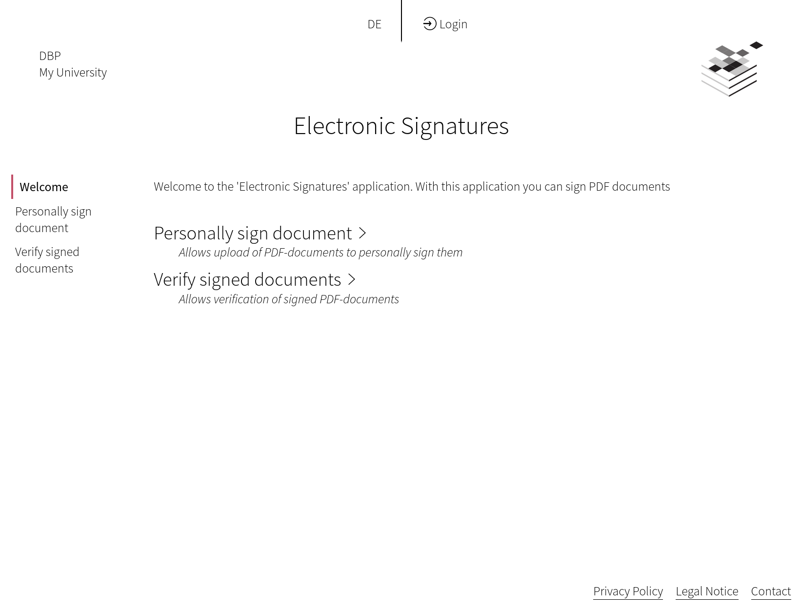

# ESign

Digitally sign one or multiple PDF documents with a freely positioned seal. 

[Visit ESign Demo](https://dbp-demo.tugraz.at/apps/signature)

The application has two modes for signing

* **Advanced signatures:** The user signs on behalf of an organization, like a University, by being authorized to do so.
* **Qualified signatures:** The users signs personally, verifying their identity during the process via a mobile phone.

Signature verification is currently handled by referring to <https://www.rtr.at/TKP/was_wir_tun/vertrauensdienste/Signatur/signaturpruefung/Pruefung.de.html>

## Screenshot

<figure markdown>
{: style="max-width:800px; width: 100%; box-shadow: 0px 0px 5px #888;" }
</figure>

## Example tech stack

- A [**Keycloak**](https://www.keycloak.org/guides) server
- A **LAMP server** (Linux, Apache, MySQL/MariaDB, PHP>=7.3), but MySQL/MariaDB is not needed in this case
    - The dependency manager for PHP [Composer 2](https://getcomposer.org/) also needs to be installed
    - `git` >= 2.25 needs to be installed
    - In case that the frontend will also be hosted on the same server, then **npm** needs to be installed too
    - Several **PHP extensions** need to be present: `ext-ctype`, `ext-dom`, `ext-fileinfo`, `ext-filter`, `ext-json`,
      `ext-ldap`, `ext-libxml`, `ext-mbstring`, `ext-mysql`, `ext-openssl`, `ext-pcre`, `ext-reflection`, `ext-simplexml`, `ext-soap`,
      `ext-spl`, `ext-tokenizer`, `ext-xml`, `ext-redis`, `ext-curl`, `ext-gmp`
- **Domains** (or sub-domains) along with the needed **TLS/SSL certificates** for the Relay API web server,
  the frontend web server and the Keycloak server

## Installation

```{.mermaid style="max-width:600px; margin: auto"}
graph TB
    frontend(ESign App) --> relay(Relay API Gateway)
    frontend --> keycloak[Keycloak Server]
    relay --> esign-bundle[[ESign Bundle]]
    relay --> frontend-bundle[[Frontend Bundle]]
    relay --> auth-bundle[[Auth Bundle]]
    esign-bundle --> pdf-as[PDF-AS]
    esign-bundle --> moa-spss[MOA-SPSS]
    esign-bundle  -->  core-bundle[[Core Bundle]]
    frontend-bundle --> core-bundle
    auth-bundle --> local-system("University systems (e.g. LDAP)")
    auth-bundle --> keycloak
    keycloak --> local-system
    pdf-as --> a-trust[A-Trust]
    moa-spss --> a-trust

    style frontend fill:#d0d0ff,stroke:#333,stroke-width:4px
```

### Frontend App

You can install the frontend application with a simple command you can find on 
[ESign frontend installation](https://gitlab.tugraz.at/dbp/esign/signature#using-this-app-as-pre-built-package).

The frontend app currently depends on a `default` profile being configured in
the backend for the qualified signature and a `official` profile for the
advanced signature. This will be made [configurable in a future version](https://gitlab.tugraz.at/dbp/esign/signature/-/issues/48).

If you want to customize your frontend, please have a look at the [theming and individualizing your application guide](../frameworks/frontend/theming.md). There, an detailed description of individualizing your fonts, colors, icons, and other assets is given.

### Keycloak Server

You need to install and set up the Open Source Identity and Access Management [Keycloak](https://www.keycloak.org/).

!!! tip
    There is small guide about the [Keycloak Client Setup](../frameworks/frontend/keycloak_integration.md).


### PDF-AS

For the actual PDF signing you need a [PDF-AS](../components/supporting-software/pdf-as.md) server 4.1.5+ by [EGIZ](https://joinup.ec.europa.eu/collection/e-government-innovation-center-egiz/about).

We provide two pre-configured variants of pdf-as, you need at least one of them depending on your use case:

* [PDF-AS Server for Advanced Signatures](https://gitlab.tugraz.at/dbp/esign/pdf-as-server-advanced) - Configured for advanced signatures
* [PDF-AS Server for Qualified Signatures](https://gitlab.tugraz.at/dbp/esign/pdf-as-server-qualified) - Configured for qualified signatures

See the repository README files for how to set them up and configure them.

### Relay API

This is a guide on how to set up the Relay API for ESign.

!!! tip
    You can find an example implementation on [relay-esign-api](https://gitlab.tugraz.at/dbp/relay/examples/relay-esign-api).


#### Screenshot

This is how this example will look like in the end.

{: style="max-width:800px; width: 100%; box-shadow: 0px 0px 5px #888;" }

#### PHP Modules and other packages

This should install most of the packages you will need on your webserver (if Apache and PHP are already installed):

=== "Debian/Ubuntu"

    ```bash
    # Install packages on Debian/Ubuntu
    apt-get -y --no-install-recommends install curl sudo git php-apcu php-apcu-bc \
      php-cli php-curl php-gd php-soap php-json php-mbstring php-mysql php-opcache \
      php-readline php-xml php-intl php-zip php-redis php-fpm php-ldap php-gmp \
      openssl composer

    # should show something like "PHP 7.3.x" (or higher)
    php -v

    # Should show something like "Composer 2.x"
    composer -V
    ```

=== "RedHat/CentOS"

    ```bash
    # Install Remi's RPM repository for php-redis and PHP 7.3
    dnf -y install https://rpms.remirepo.net/enterprise/remi-release-8.rpm

    # Install PHP 7.3
    dnf -y module install php:remi-7.3

    # Install packages on Redhat/CentOS
    dnf -y install curl composer php php-apcu php-bcmath php-cli php-curl php-gd \
      php-soap php-json php-mbstring php-mysqlnd php-opcache php-readline php-xml \
      php-intl php-zip php-redis php-fpm php-ldap php-gmp openssl php-pecl-redis5 \
      sudo git

    # should show something like "PHP 7.3.x" (or higher)
    php -v

    # Should show something like "Composer 2.x"
    composer -V
    ```

!!! warning
    Please make sure you have installed **PHP** with at least version **7.3**, **Composer** version **2** and **Git**
    with at least version **2.25**!


#### Apache Webserver configuration

First you need to enable the Apache Rewrite module so all requests can be redirected to the `index.php`.

```bash
# enable mod rewrite
a2enmod rewrite
```

In your virtual host configuration you need to allow `.htaccess` files and set your `DocumentRoot` to the `public` directory.

Note that in this example `/[VHOST-ROOT]/relay-api` will be the path where the PHP application resides.

!!! warning
    You need to replace `/[VHOST-ROOT]` with the root path of your virtual hosts!

```apacheconf
# Allow .htaccess
<Directory /[VHOST-ROOT]/relay-api>
        Options Indexes FollowSymLinks
        AllowOverride All
        Require all granted
</Directory>

# Set DocumentRoot to public directory
<VirtualHost *:80>
    DocumentRoot "/[VHOST-ROOT]/relay-api/public"
    ServerName api.your-domain

    # Other directives here ...
</VirtualHost>
```

You now can restart your web server with:

```bash
sudo service apache2 restart
```

#### App and bundle install

We will use the [DBP API Server Template](https://gitlab.tugraz.at/dbp/relay/dbp-relay-server-template) as
starting point for our implementation.

!!! tip
    Keep in mind that your current user needs to have permissions to
    create files and directories in the `/[VHOST-ROOT]` directory for this example.

```bash
# You need to replace "/[VHOST-ROOT]" with the root path of your virtual hosts!
# And keep in mind that your current user needs to have permissions to
# create files and directories in the "/[VHOST-ROOT]" directory.
cd /[VHOST-ROOT]

# Install the DBP API Server Template (https://gitlab.tugraz.at/dbp/relay/dbp-relay-server-template)
# as base Symfony PHP application
# The relay-api/public directory then is the directory to let the webserver point at 
composer create-project dbp/relay-server-template relay-api

# Change to app directory
cd relay-api

# Install the Frontend Bundle (https://gitlab.tugraz.at/dbp/relay/dbp-relay-frontend-bundle),
# which contains APIs mostly useful for frontend apps.
# It is a required dependency for all DBP frontend apps.
composer require dbp/relay-frontend-bundle

# Install the ESign Bundle (https://gitlab.tugraz.at/dbp/esign/dbp-relay-esign-bundle),
# which allows you to create permits for the Covid19 certificate evaluation process.
composer require dbp/relay-esign-bundle
```

!!! tip
    Executing `composer check-platform-reqs` shows that the required PHP extensions are installed.

#### Auth Bundle config

Follow the these steps to configure the Auth Bundle: [Configure the Auth Bundle](../components/api/auth-bundle.md)

#### ESign Bundle config

You need to [Configure the ESign Bundle](https://github.com/digital-blueprint/relay-esign-bundle#configuration).

Adapt all `PDF_AS_` settings in your `.env`.

```bash
# PDF-AS
PDF_AS_WEB_ADVANCED_URI=https://pdfas-dev.tugraz.at/pdf-as-web
PDF_AS_WEB_QUALIFIED_URI=https://sig-dev.tugraz.at/pdf-as-web
PDF_AS_WEB_QUALIFIED_STATIC_URI=https://sig-dev.tugraz.at/static
PDF_AS_VERIFICATION_ENABLE=false
```

#### Health Checks

If you are finished setting up and configuring the API server you can run the
builtin health checks to ensure that all external systems are reachable and
correctly hooked up.

Simply run the following in the API server directory:

```bash
./bin/console dbp:relay:core:check-health
```

If everything is working it should print something like:

```ini
[esign]
  Check if we can reach the pdf-as-web SOAP interface: [SUCCESS]
  Check if we can reach the callback URLs: [SUCCESS]
[core.queue]
  Check if the queue is configured: [SUCCESS]
[core.symfony]
  APP_SECRET should be set: [SUCCESS]
  APP_ENV should be set to 'prod': [SUCCESS]
[core.system]
  Check if DNS is working: [SUCCESS]
  Check if TLS is working: [SUCCESS]
```

#### Running in Production

When you are done with setting things up please visit [Running in Production](../frameworks/relay/admin/production.md)
to learn how to run the Relay API in production.
