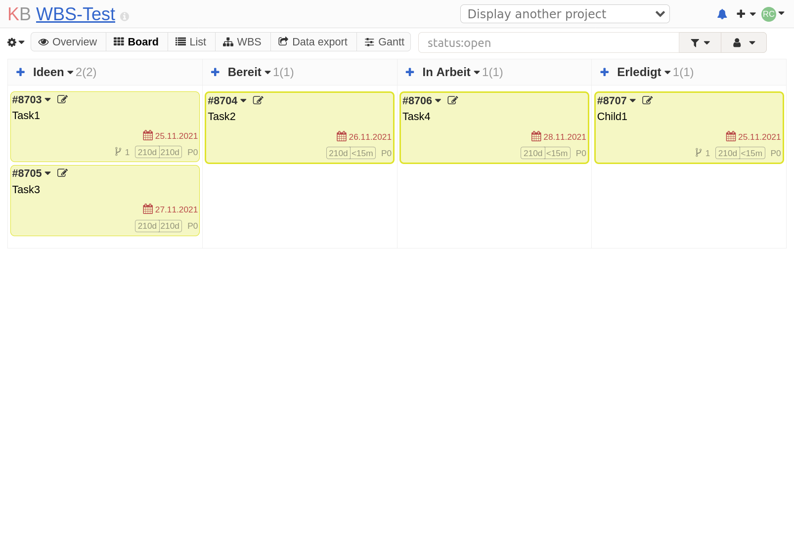

# Plan

The Plan project goal is a free and open source project management tool set that
is a good fit for all Universities and all types of project management styles.

It consists of Kanboard, a free and open source
Kanban project management software, plus a set of plugins which extend its
functionality and also integrate it with other systems.

!!! note
    This page is work in progress. More information will follow soon.

## Screenshot

<figure markdown>
{: style="max-width:800px; width: 100%; box-shadow: 0px 0px 5px #888;" }
</figure>