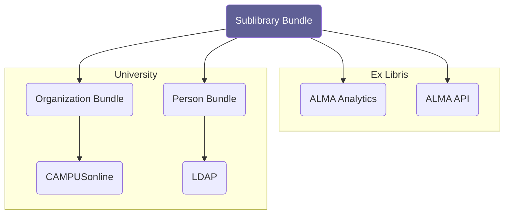

# Sublibrary

!!! note
    This guide is currently a work in progress.




## Development Guide Backend

First create an API gateway:

```bash
composer create-project dbp/relay-server-template my-api
cd docker-dev
./build.sh
docker compose up
```

You can access the API at `http://api.localhost:8000`.

Then we need to install the required API bundles:

```bash
composer require dbp/relay-frontend-bundle
composer require dbp/relay-sublibrary-bundle
composer require dbp/relay-sublibrary-connector-base-organization-bundle
composer require dbp/relay-base-organization-bundle
composer require dbp/relay-base-organization-connector-campusonline-bundle
composer require dbp/relay-base-person-bundle
composer require dbp/relay-base-person-connector-ldap-bundle
composer require dbp/relay-core-connector-oidc-bundle
composer require dbp/relay-core-connector-ldap-bundle
```

### Configuration

**relay-frontend-bundle:**

Give every user the frontend role for managing the library:

```yaml
dbp_relay_frontend:
  roles:
    ROLE_LIBRARY_MANAGER: 'true'
```

**relay-sublibrary-bundle**

Fill out the `SUBLIBRARY_*` environment variables in `.env.local`.

in `dbp_relay_sublibrary.yaml`:

```yaml
dbp_relay_sublibrary:
    api_url: '%env(SUBLIBRARY_ALMA_API_URL)%'
    api_key: '%env(SUBLIBRARY_ALMA_API_KEY)%'
    analytics_api_key: '%env(SUBLIBRARY_ALMA_ANALYTICS_API_KEY)%'
    person_local_data_attributes:
        email: email
        alma_id: almaId
    authorization:
        roles:
            ROLE_LIBRARY_MANAGER: 'true'
        attributes:
            SUBLIBRARY_IDS: '["1263"]'
            ALMA_LIBRARY_IDS: '["F2190"]'
```

* Set `ROLE_LIBRARY_MANAGER: 'true'` to allow everyone to access the API
* Fill out `SUBLIBRARY_IDS` with the IDs used by the base organization connector that the user should have access to
* Fill out `ALMA_LIBRARY_IDS` with the ALMA library IDS that the user should have access to
* Set `person_local_data_attributes` to map to the attributes that are exposed by the base person connector

**relay-sublibrary-connector-base-organization-bundle**

Configure that the library code is retrieved via the "code" attribute from the base organization:

```yaml
dbp_relay_sublibrary_connector_base_organization:
    library_code_local_data_attribute: 'code'
```

**relay-base-organization-bundle**

No configuration needed.

**relay-base-organization-connector-campusonline-bundle**

Fill out the `CAMPUS_ONLINE_*` environment variables in `.env.local`.

Map the organization code to the "code" attribute:

```yaml
dbp_relay_base_organization_connector_campusonline:
  local_data_mapping:
    - local_data_attribute: code
      source_attribute: code
```

**relay-base-person-bundle**

No configuration needed.

**relay-base-person-connector-ldap-bundle**

Fill out the `LDAP_PERSON_PROVIDER_*` environment variables in `.env.local`.

Map the following LDAP attributes to the local data attributes:

```yaml
dbp_relay_base_person_connector_ldap:
  local_data_mapping:
    - local_data_attribute: email
      source_attribute: mail
    - local_data_attribute: almaId
      source_attribute: co-alma-patron-id
```

**relay-core-connector-ldap-bundle:**

Fill out the `LDAP_*` environment variables in `.env.local`.
If needed adjust the encryption method in `config/packages/relay_core_connector_ldap.yaml`:

```yaml
dbp_relay_core_connector_ldap:
    connections:
        DEFAULT:
          encryption: 'simple_tls'
```

**relay-core-connector-oidc-bundle:**

Fill out the `OIDC_*` environment variables in `.env.local`.

**relay-base-person-connector-ldap-bundle**

Fill out the `LDAP_PERSON_PROVIDER_LDAP_ATTRIBUTE_*` environment variables in `.env.local`.

Add a local data mapping required by the sublibrary bundle:

```yaml
dbp_relay_base_person_connector_ldap:
  local_data_mapping:
    - local_data_attribute: email
      source_attribute: "mail"
    - local_data_attribute: almaId
      source_attribute: co-alma-patron-id
```

### Final Steps & Customization

After everything is configured you can run the health checks to see if everything
is working:

```bash
./bin/console dbp:relay:core:check-health
```

If your library <-> organization mapping is not straight forward because the ID
format is different you can adjust the mapping in PHP code by implementing an
event handler for `SublibraryProviderPostEvent`.

Now you can start the accompanying frontend app.

## Development Guide Frontend

Clone the app, install all dependencies and start the development server:

```bash
git clone https://github.com/digital-blueprint/sublibrary-app
cd sublibrary-app
git submodule update --init
npm install
npm run watch
```
