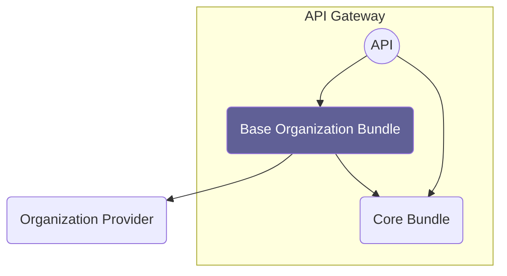

# Overview

Source: https://github.com/digital-blueprint/relay-base-organization-bundle

### Organization Provider

An interface that needs to be implemented and provides the organizational
structure of the institution. For example implemented via CAMPUSOnline or LDAP.
