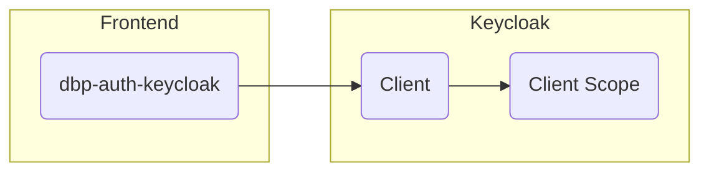

# Keycloak Integration

For frontend authentication we use [OpenID
Connect](https://openid.net/connect/). In practice we use
[Keycloak](https://www.keycloak.org), but any OIDC service should work. Although
we haven't tested with any other implementation, so some more work might be needed
there.



## Frontend Configuration

In the frontend you can use the `<dbp-auth-keycloak>` web component which takes a
Keycloak specific configuration and handles everything from redirection to
Keycloak for login, to auto-login via an iframe as well as refreshing the access
key.

```html
<dbp-auth-keycloak
  url="https://auth-dev.tugraz.at/auth"
  client-id="my-client-id"
  realm="my-realm"
></dbp-auth-keycloak>
```

See the [component docs](https://github.com/digital-blueprint/toolkit/blob/main/packages/auth/README.md) for more information.

In Keycloak this requires a realm with the name `my-realm` as well as a client with the name `my-client-id`.

## Creating a Frontend Keycloak Client

First we need to create a new Keycloak client, via "Clients" and click the "Create" button:

{: style="max-width: 400px; border: 1px solid #000"}

Fill out as shown above and click "save". The default configuration should be good enough for starters.

This now alloes the frontend to log the user in and receive an access token, which it can use to authenticate and authorize the user in the backend. The frontend as well as the backend depend on some fields in the access token being present or match some value. The easiest way to configure what ends up in the token is to create a client scope and assign that client scope to the client we have just created.

## Creating a Frontend Client Scope

In the end we want the token to contain the following information:

* The `"name"` field needs to be included in the token, containing the full name
  of the user. This is handled by the `"User's full name"` mapper type in
  Keycloak.
* The `"preferred_username"` field needs to be included in the token, containing
  the ID of the user as expected by the API backend. This is handled by a `"User
  Property"` mapper type in Keycloak.
* The `"aud"` field needs to be included in the token, containing the "audience"
  expected by the API backend, if configured to be required there. This is a
  security measure to prevent unrelated tokens generated by the same Keycloak
  realm to be accepted by the API backend. This is handled by a `"Audience"`
  mapper type in Keycloak.

Got to "Client Scopes" and "Create".

{: style="max-width: 400px; border: 1px solid #000"}

The client scope includes three mappers, the first two are builtin ones for "username" and "full name":

{: style="max-width: 400px; border: 1px solid #000"}

The last mapper is a new one of the type "Audience". Set the custom audience value to the one expected by the API gateway:

{: style="max-width: 400px; border: 1px solid #000"}

After all this is set up you can add this client scope to all frontend related Keycloak clients as a default scope. "Clients", select the client, go to "Client Scopes" and see the section "Default Client Scopes":

{: style="max-width: 400px; border: 1px solid #000"}

The resulting token should be a super set of the following example:

```json
{
  "aud": "api-gw",
  "name": "Erika Musterfrau",
  "preferred_username": "erika_musterfrau"
}
```

You can show an example token by gong to the client, then "Client Scopes", "Evaluate", select an existing user, click "Evaluate" and go to "Generated Access Token". It should show a JSON example of the token which should contain the fields mentioned above.

Now your frontend application should be ready to use. You can test by logging in and testing some functionality which talks to the backend API.

# Adding more Clients

If you want to set up another app you can simply create a new client as described above and re-use the same client scope there as well.
