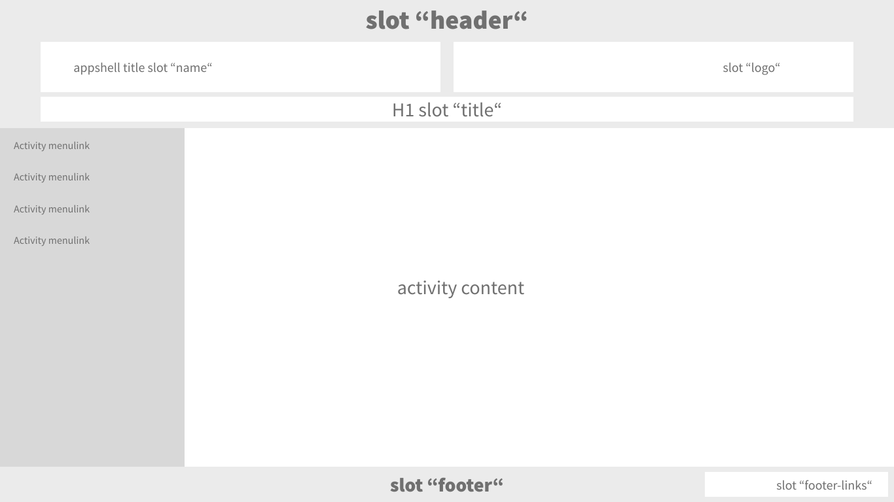

# Custom Content

You can use various slots to customize your application. You can place your
custom assets like images or customized texts inside of slots to adapt the
appearance of the application as you want.  

## App shell slots

<figure id="fig1" style="width:100%;">
    
    <figcaption>
        <b>Fig. 1: App shell slots visualization</b>
    </figcaption>
</figure>

<figure id="fig2">
    
    <figcaption>
        <b>Fig. 2: App shell slots mobile visualization</b>
    </figcaption>
</figure>

You can adapt the **name**, **title**, **logo** or exchange the whole **header**, the **footer-links**
or exchange the whole **footer**. [[Fig. 1]](#fig1) [[Fig. 2]](#fig2)
The nearer description can be found in the documentation of the [app shell](https://github.com/digital-blueprint/toolkit/tree/main/packages/app-shell){:target="_blank"}.

You should place these slots in the `<template id= "global-override">` tag of your `index.html`.

For example, you can override the name in the top left corner, and the logo shown in the top right corner:

```html
<template id="global-override">
    <template id="dbp-greenlight">
        <div slot="name">
            MyUni<br />
            <dbp-translated subscribe="lang">
                <div slot="de">
                    Meine Universität
                </div>
                <div slot="en">
                    My University
                </div>
            </dbp-translated>
        </div>
        <div slot="logo">
            
        </div>
    </template>
</template>

```

## App specific Slots
Often there are app-specific slots or rather, activity-specific slots. These slots are often used for text customization.
In the activity description, in the `src` folder of the application you can read which slots are available.

You should place these slots in the `<template id= "global-override">` tag of your `index.html`.

For example:

```html
<template id="global-override">
    <dbp-acquire-3g-ticket lang="de">
        <template slot="description">
            <dbp-translated subscribe="lang">
                <div slot="de">
                    Erstellt ein Ticket für den Zugang zu Räumlichkeiten der TU Graz.
                </div>
                <div slot="en">
                    Creates a ticket for access to premise of TU Graz.
                </div>
            </dbp-translated>
        </template>
    </dbp-acquire-3g-ticket>
</template>

```
