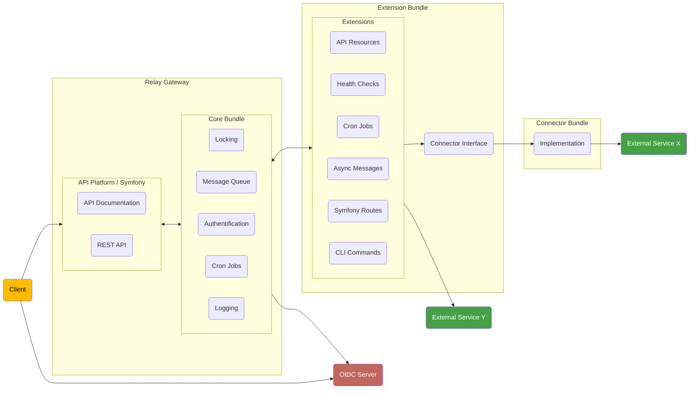

# Overview

The relay API gateway is written in [PHP](https://www.php.net/) and is based on
the [API Platform](https://api-platform.com) framework as well as the
[Symfony](https://www.symfony.com) framework. 

To achieve modularity and extensibility we depend on the Symfony bundle system
which allows installing "extra parts" to an existing application server, like
new API endpoints, new adapters to external systems, and so on.

The following graph shows a more technical overview of how a bundle integrates
into the API gateway:

The core bundle provides various common functionality to all bundles and also
allows bundles to extend the API gateway in various ways, so they can:

* use the [logging system](./logging.md)
* use the [locking system](./locks.md)
* register [new API resources](./api.md) and expose the added API in the
  generated OpenAPI documentation
* register new [health checks](./health_checks.md)
* register new [cron jobs](./cron.md)
* [register Symfony messages](./queue.md) to be routed to the global worker queue
* register [custom Symfony routes](./api.md) for special endpoints that
  don't fit the api-platform design
* register [CLI commands](./cli_commands.md) accessible via the Symfony console

## Bundle Architecture

See [Extending with Bundles](../admin/extending_with_bundles.md) for the different
types of bundles and their use cases.
