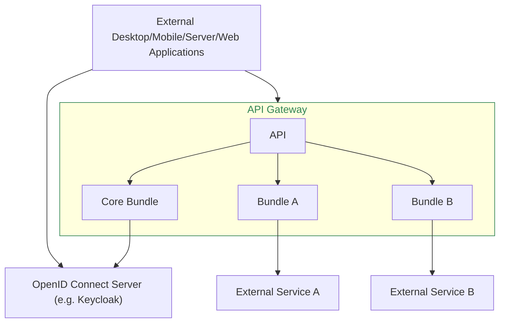

# Overview

The "Relay API Gateway" is a framework for creating a REST API server for
building applications and workflows on top of it. It abstracts away various
backend systems, provides user management, authentication, caching, locking,
authorization and a modular system for composing an API with so called API
bundles. Various bundles are readily available and can be configured to your
needs, or you can write your own bundles to extend the system/API.

The framework consists of a core bundle which provides functionality that's
useful in a multitude of API use cases, authentication, caching, logging,
automatic API documentation, integration with the Symfony and API Platform
frameworks etc.

All other functionality is implemented in extra bundles which can add new
endpoints to the API and, in turn, can depend on other bundles and their
endpoints. For example a bundle providing a library management API can add new
endpoints for working with books by talking to an external library system. It
can depend on the core bundle for user management and authentication.

### API Clients

External apps, like browser or mobile applications can be written easily to
access data via the API. The user authentication is done via an OIDC
server like Keycloak.

An example for a web application would be the [Library
application](https://dbp-demo.tugraz.at/apps/sublibrary).

External services like server applications that don't act on behalf of a user
can access the API via "Client Credential" grants, also available in Keycloak
for example.

### Extending and Customizing

The API gateway can be easily extended by simply [installing an existing
bundle](./admin/extending_with_bundles.md), changing exiting bundle behavior via
[event hooks](./dev/hooks.md), or writing your very own bundle.

If you write your own bundle you can create completely new APIs, or connect an
existing API to a new external system. If you then share your bundle with the
world everyone can install it and profit 😊

For how to write your own bundle please see our [Developer Guide](./dev/index.md).
