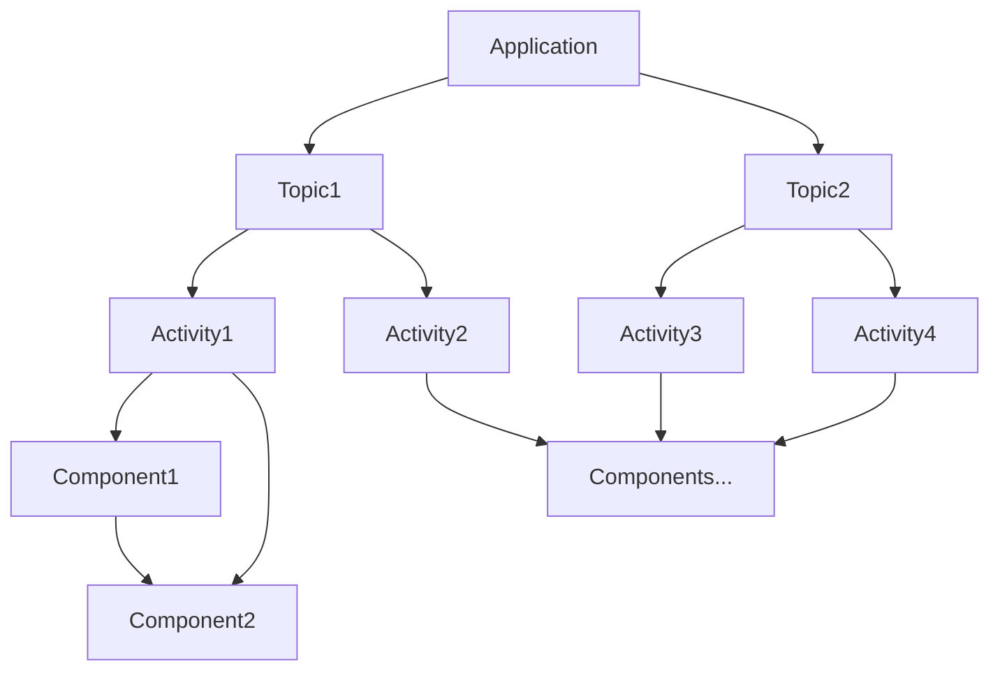

# Web Components

We currently defined multiple types of components:

* Simple web components
* Activity components
* Topics
* Applications

## Simple Web Components

They have the following attributes:

* Provide attributes and properties for configuration and data input
* Emit events for data output
* Don't leak any internal web components

## Activity Components

The same as simple web components, but they provide an additional metadata that
describe them. This allows applications to show information about them and
search for them without actually loading the Javascript.

## Topics

A topic is a set of activities that are somehow related. Activities can be in
multiple topics if wanted.

## Applications

Applications provide a shell around activities, topics or multiple topics. They
provide authentication, routing, menus, navigation, search, layout features for
responsiveness, saving and restoring state, PWA integration etc.
