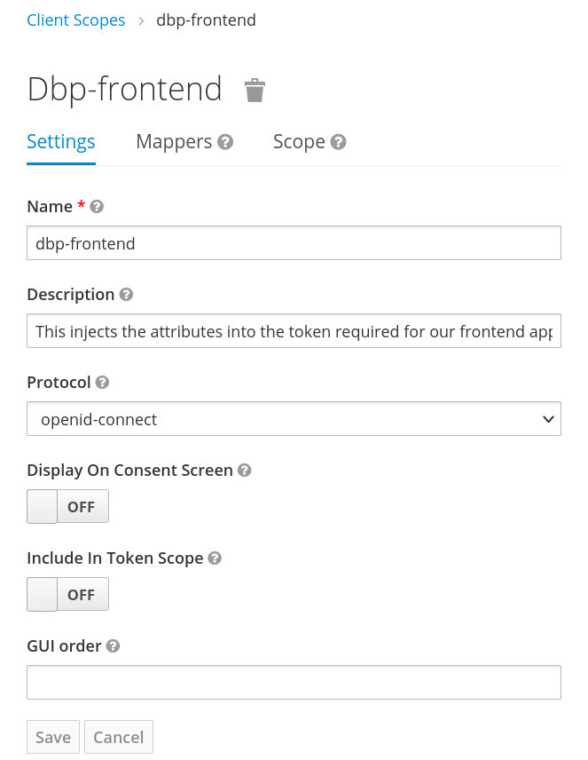

# Frontend Authentication

For frontend authentication we use [OpenID
Connect](https://openid.net/connect/). In practice we use
[Keycloak](https://www.keycloak.org), but any OIDC service should work. Although
we haven't tested with any other implementation, so some fixes might be needed
there.

## Keycloak Client Setup

In case you use the `dbp-auth-keycloak` web component you need to configure it
with the Keycloak realm, client ID and so on. In addition you have to create a
matching client on the Keycloak side of things. This client needs to map some
things into the access token for `dbp-auth-keycloak` to work:

* The `"name"` field needs to be included in the token, containing the full name
  of the user. This is handled by the `"User's full name"` mapper type in
  Keycloak.
* The `"preferred_username"` field needs to be included in the token, containing
  the ID of the user as expected by the API backend. This is handled by a `"User
  Property"` mapper type in Keycloak.
* The `"aud"` field needs to be included in the token, containing the "audience"
  expected by the API backend, if configured to be required there. This is a
  security measure to prevent unrelated tokens generated by the same Keycloak
  realm to be accepted by the API backend. This is handled by a `"Audience"`
  mapper type in Keycloak.

You can combine all these mappers into one client scope:

{: style="max-width: 400px; border: 1px solid #000"}

The client scope includes three mappers, the first two are builtin ones for "username" and "full name":

{: style="max-width: 400px; border: 1px solid #000"}

The last mapper is a new one of the type "Audience". Set the custom audience value to the one expected by the API gateway:

{: style="max-width: 400px; border: 1px solid #000"}

After all this is set up you can add this client scope to all frontend related Keycloak clients as a default scope.

The resulting token should be a super set of the following example:

```json
{
  "aud": "api-gw",
  "name": "Erika Musterfrau",
  "preferred_username": "erika_musterfrau"
}
```