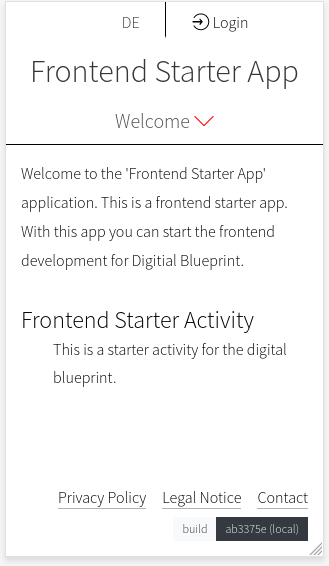

# Getting Started

1. Check out the starter app

```
git clone https://gitlab.tugraz.at/dbp/web-components/dbp-template-app
cd dbp-template-app
git submodule update --init
```

2. Install the required dependencies

```
npm install
```

3. Start the development server

```
npm run watch
```

5. Open https://127.0.0.1:8001 in your browser


