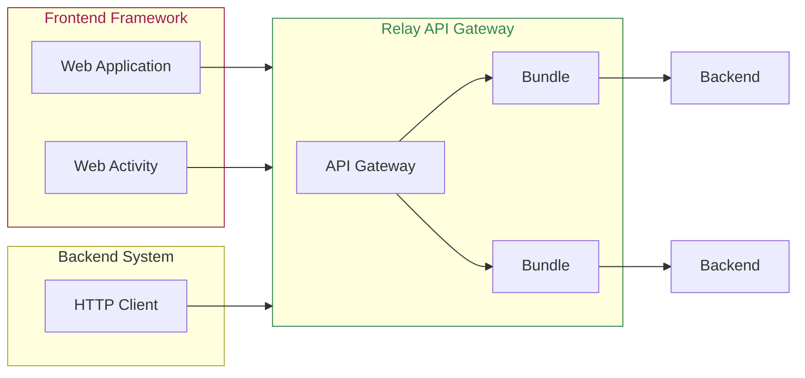

# Overview

This handbook contains documentation for integrators, system administrators,
designers, developers and users of the DBP framework.

The DBP framework is open source and consists of a modular [API gateway](./relay) providing a REST
API as well as a web component based [frontend framework](./frontend) for
building web applications as well as single activities that can be embedded in
existing web applications.
