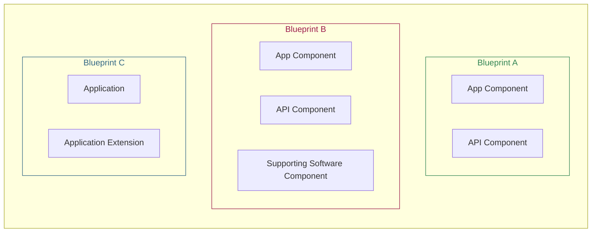
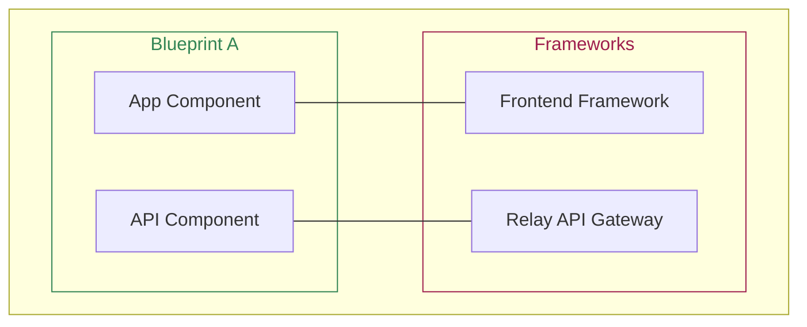
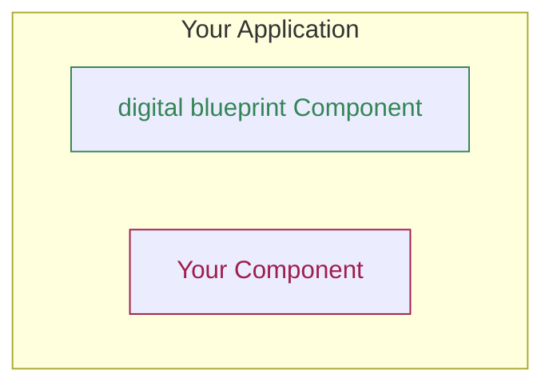

# Overview

The Digital Blueprint project consists of blueprints. Each blueprint consists of several components, such as front-end applications, back-end APIs, existing software projects with extensions, or other supporting software. Together they provide a service for your users.

Many of the components, which make up a blueprint, make use of our own frontend and API framework.

Many of the components are not tied to their blueprints and can be re-used in external contexts, like your own applications.

