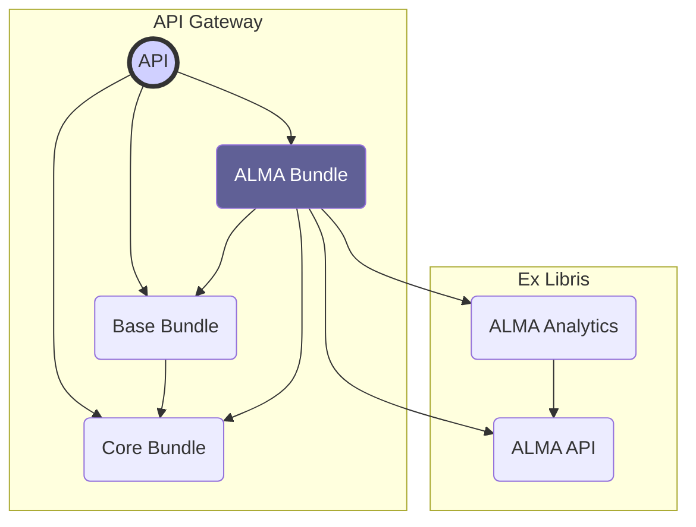

# Overview

### ALMA API

Library information is fetched and stored via the [ALMA API](https://developers.exlibrisgroup.com/alma/apis/bibs)
provided by [ExLibris](https://www.exlibrisgroup.com/).

### ALMA Analytics

Additional library information, that can't be accessed by the public [ALMA API](#alma-api) is
fetched from [ALMA Analytics](https://developers.exlibrisgroup.com/alma/apis/analytics)
by [ExLibris](https://www.exlibrisgroup.com/).