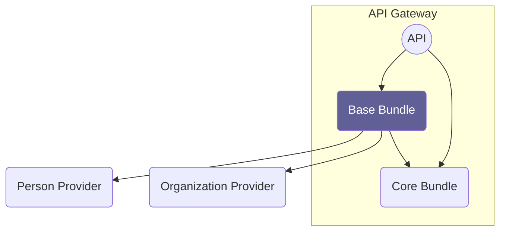

# Overview

### Organization Provider

An interface that needs to be implemented and provides the organizational
structure of the institution. For example implemented via CAMPUSOnline or LDAP.

### Person Provider

An interface that needs to be implemented and provides the information for all
API users. Can be implemented using LDAP, Keycloak, CAMPUSOnline, etc. or a
combination of multiple backends.
