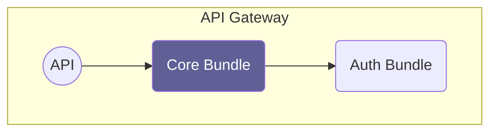

# Overview

### Auth Bundle

The auth bundle takes care of user authentication and communicates with an OIDC
server, for example [Keycloak](https://www.keycloak.org). It creates the Symfony
user object and converts OAuth2 scopes to Symfony user roles.