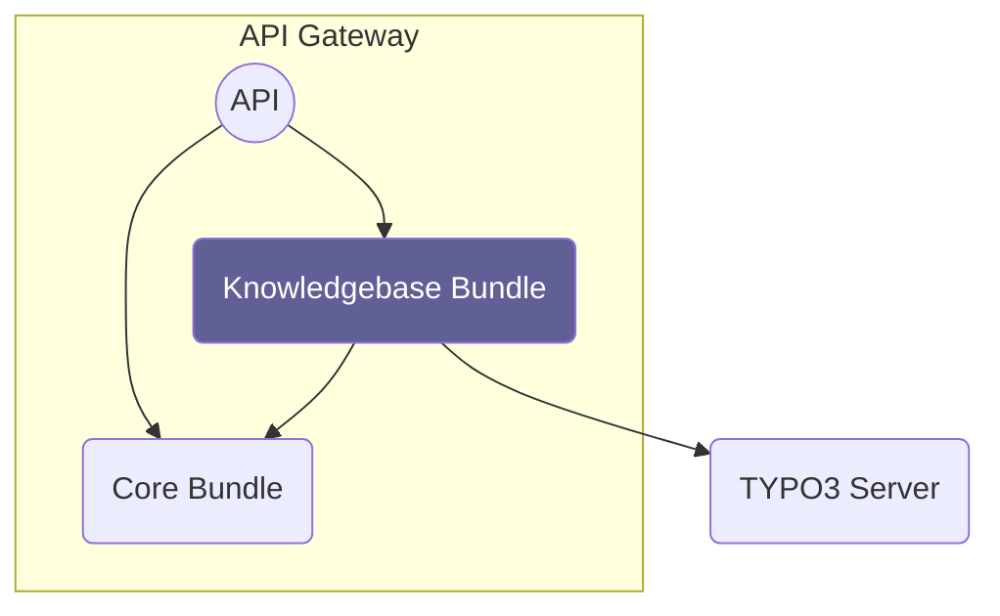

# Overview

```mermaid
graph TD
    style knowledgebase_bundle fill:#606096,color:#fff

    typo3("TYPO3 Server")

    subgraph API Gateway
        api(("API"))
        core_bundle("Core Bundle")
        knowledgebase_bundle("Knowledgebase Bundle")
    end

    api --> core_bundle
    api --> knowledgebase_bundle
    knowledgebase_bundle --> core_bundle
    knowledgebase_bundle --> typo3

    click typo3 "./#typo3"
```

### TYPO3

[TU4U](https://tu4u.tugraz.at/) acts as knowledge base to access important information
that can be maintained by editors.
