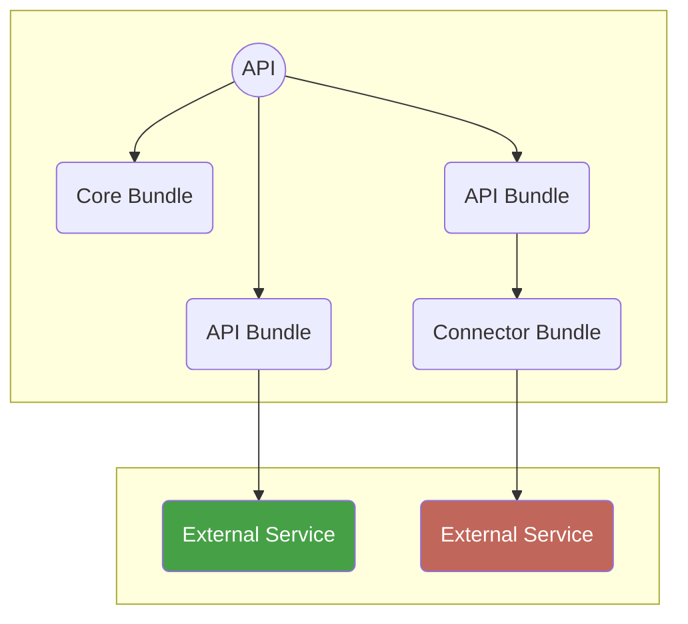

# Extending with Bundles

By default, a fresh API server does not provide any API or other client facing
functionality. You can extend the server with features by adding so-called
bundles.

There are three types of bundles:

* **Core bundles** — bundles which provide core functionality
* **API bundles** — bundles which add API endpoints - they come in different
  forms:
    * **Fully self contained** bundles which handle everything themselves, from
      storage to communicating with external services.
    * **Not fully self contained** bundles which need one more connector bundles
      for talking to external services. This allows users to easily switch
      between different external services, or develop a custom connector for
      their own external service.
    * Or bundles which are a **mix of the above two**, where for example some
      storage mechanism is implemented in the API bundle directly, but
      communication with some external API is handled via a connector bundle.
* **Connector bundles** — bundles which connect an API bundle with some external
  service or backend.



## Installing & Configuring a Bundle

Adding a bundle is as simple as installing it with composer:

```shell
composer require dbp/relay-greenlight-bundle
```

Installing will do the following things:

* Register the bundle in the `config/bundles.php` file.
* Write an example configuration file under `config/packages`. See the [bundle
  configuration page](./bundle_config.md) for details.
* Write various example configuration environment variables into the `.env`
  file. See the [configuration page](./config.md) for details.

In some cases the API bundles also requires a corresponding connector bundle to
be installed. For example:

```shell
composer require dbp/relay-greenlight-connector-campusonline-bundle
```

Once everything is configured you can check that everything is working correctly
via the [health check command](./debugging.md#health-checks).
