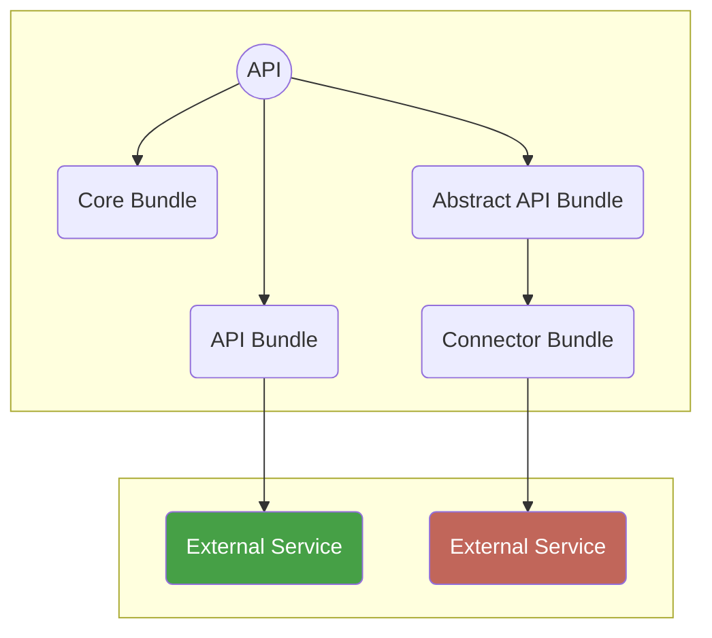

# Extending with Bundles

By default a fresh API server does not provide any API or other client facing
functionality. You can extend the server with features by adding so called
bundles.

There are four types of bundles:

* **Core bundles** — bundles which provide core functionality
* **API bundles** — self contained bundles which add API endpoints and
  optionally connect with some external service
* **Abstract API bundles** — bundles which provide API endpoints but leave the
  actual implementation up to a connector bundle
* **Connector bundles** — bundles which connect an abstract bundle with some
  external service to make them complete.



## Installing & Configuring a Bundle

Adding a bundle is as simple as installing it with composer:

```
composer require dbp/relay-greenlight-bundle
```

Installing will do the following things:

* Register the bundle in the `config/bundles.php` file.
* Write an example configuration file under `config/packages`. See the [bundle
  configuration page](./bundle_config.md) for details.
* Write various example configuration environment variables into the `.env`
  file. See the [configuration page](./config.md) for details.

In case of an abstract bundle you also need to add a corresponding connector
bundle.

Once everything is configured you can check that everything is working correctly
via the the [health check command](./health_checks.md).
