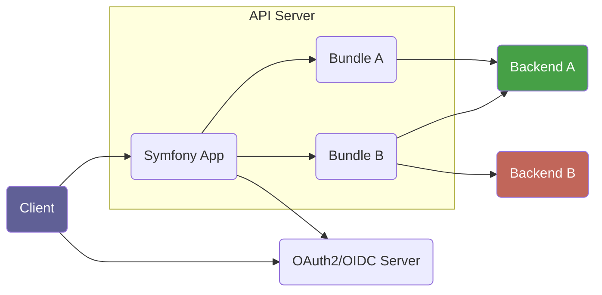

# Getting Started

Here we want to show you how to run an example API server on your machine, so
you know which technologies are involved and get a better feeling of how things
are connected.

The overall architecture of the server framework consists of a Symfony
application and various Symfony bundles. The bundles each provide their own REST
API to the user and talk with zero or more backend system. The API server
exposes the sum of all API endpoints provided by the active bundles to the user
and handles authorization via OAuth2.



To get you up and running fast we provide two PHP packages that you can use as a starting point:

* **The "API Server Template":** This is a Symonfy App skeleton with good
  default settings and integration for CI, testing, linting and so on. You can
  copy this project and use it as a starting point for your own server. →
  https://gitlab.tugraz.at/dbp/middleware/dbp-api/api-server-template

* **The "API Starter Bundle":** It includes code for all the things a typical
  bundle can contain to show what is possible. You can copy this bundle and
  rename it to act as a starting point for your own REST API. →
  https://gitlab.tugraz.at/dbp/middleware/dbp-api/api-starter-bundle

## Prerequisites

Note: This is only tested on Linux so far, but any operating system supporting docker and docker-compose should work.

* docker
* docker-compose
* git

Optional (In case you want to work outside of docker):

* php7.3+
* php extensions, see the [Dockerfile](https://gitlab.tugraz.at/dbp/middleware/dbp-api/api-server-template/-/blob/main/docker-dev/php-fpm/Dockerfile) for a list
* composer 2.x

## Setup

Note: If you don't have `bash` you can execute the commands in the shell scripts (`*.sh`) manually.

```shell
composer create-project dbp/relay-server-template my-api "dev-main"
cd my-api
cd docker-dev
./build.sh          # to build the required docker images
./run.sh            # to get a shell in the main docker container
composer install    # to install the php dependencies inside the container
exit                # to exit the docker container
docker-compose up   # to start the server
```

Now visit <http://localhost:8000> to see the server API description interface, which should look something like this:

{: style="max-width: 400px; width:100%; border: 1px solid #333; box-shadow: 0px 0px 3px #ccc;" }

Any code changes will be immediately visible on the next request.

In some cases some of the above steps need to be repeated:

* `composer install` to clear caches, or to install new dependencies
* `./build.sh` in case the Dockerfile has changed

## Next steps

Now you have a working Symfony application. Some potential next steps are:

* Convert your app to a git repository to easily track changes
* Install existing feature bundles to expose new API and configure them
* Create your own feature bundle, see [Creating a New Bundle](./dev/new_bundle.md)
* Deploy your application, see [Running in Production](./production.md)

## Docker-Compose Extra Services

The api server can use [Redis](https://redis.io/) as well as
[MariaDB](https://mariadb.org/) for locking and for message queuing. The
`docker-compose.yml` includes an instance of
[Redis-Commander](https://joeferner.github.io/redis-commander/) to monitor the
service which you can reach at <http://127.0.0.1:8101>. It also includes an
instance of [phpMyAdmin](https://www.phpmyadmin.net/) which can reach at
<http://127.0.0.1:8102>.
