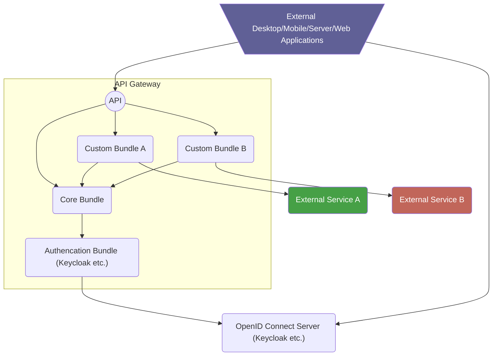
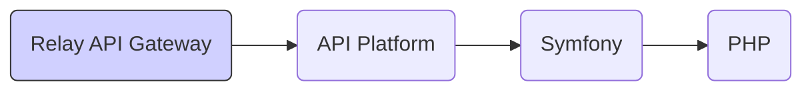

# About

The "Relay API Gateway" is a framework for creating a REST API server for
building applications and workflows on top. It abstracts away various backend
systems, provides user management, authentication, caching, locking,
authorization and a modular system for composing an API with so called API
bundles. Various bundles are readily available and can be configured to your
needs, or you can write your own bundles to extend the system/API.

The framework consists of a core bundle which provides functionality that's
useful in a multitude of API use cases, authentication, caching, logging,
automatic API documentation, integration with the Symfony and API Platform
frameworks etc.

The core bundle is not functional by itself but requires an authentication
bundle, for example our Keycloak bundle, which validates Keycloak access tokens
and integrates them with the Symfony security system.

All other functionality is implemented in extra bundles which can add new
endpoints to the API and, in turn, can depend on other bundles and their
endpoints. For example a bundle providing a library management API can add new
endpoints for working with books by talking to an external library system. It
can depend on the core bundle for user management and authentication.

Bundles come in two forms, one which abstracts away a specific system and only
requires configuration for where to locate the system (the alma bundle only
works with alma). The other form focuses on defining the REST API and leaves the
implementation and the communication with external systems to the bundle
integrator via unimplemented interfaces (the knowledgebase bundle can get its
data from various data sources but always provides the same API).

### API Clients

External apps, like browser or mobile applications can be written easily to
access data via the [API](#api). The user authentication is done via an OIDC
server like Keycloak.

An example for a web application would be the [Library
application](https://ibib.tugraz.at/en).

External services like server applications that don't act on behalf of a user
can access the API via "Client Credential" grants, also available in Keycloak
for example.

### Used Technologies

