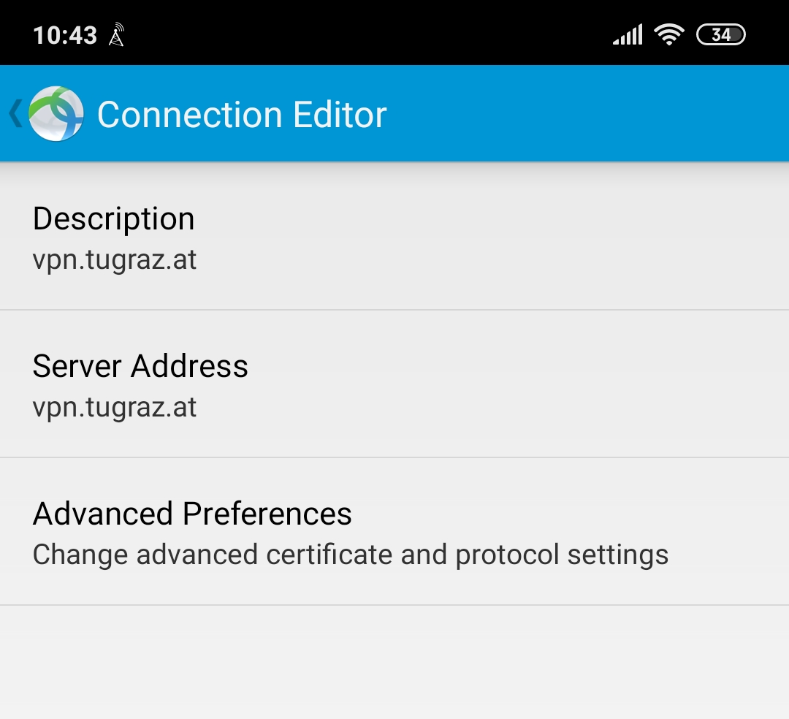
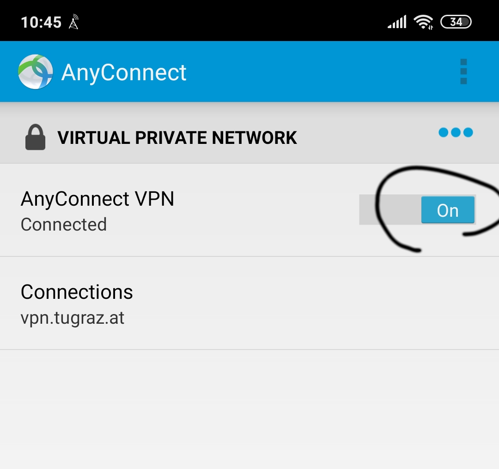
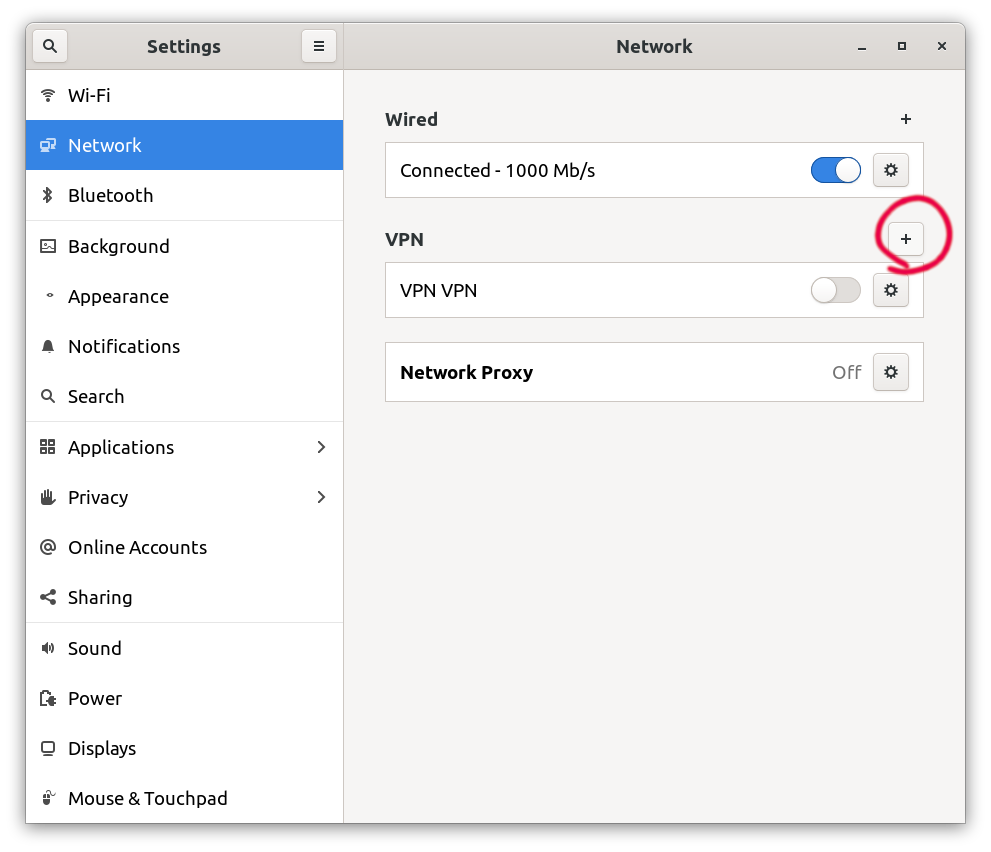
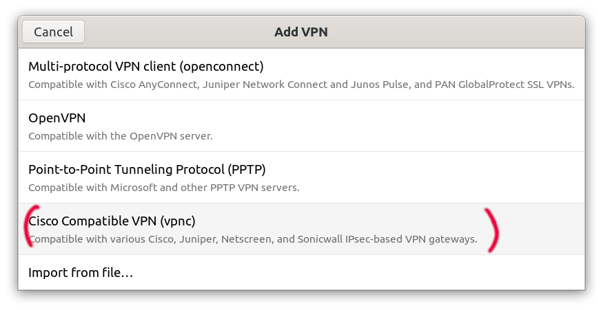
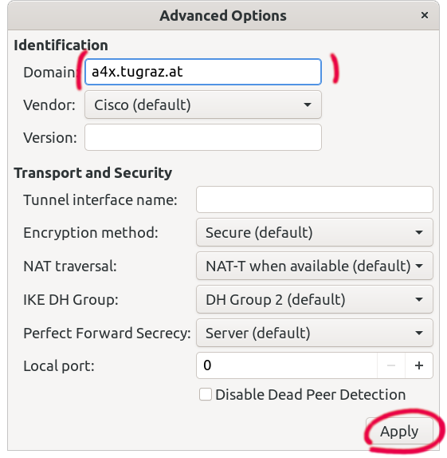
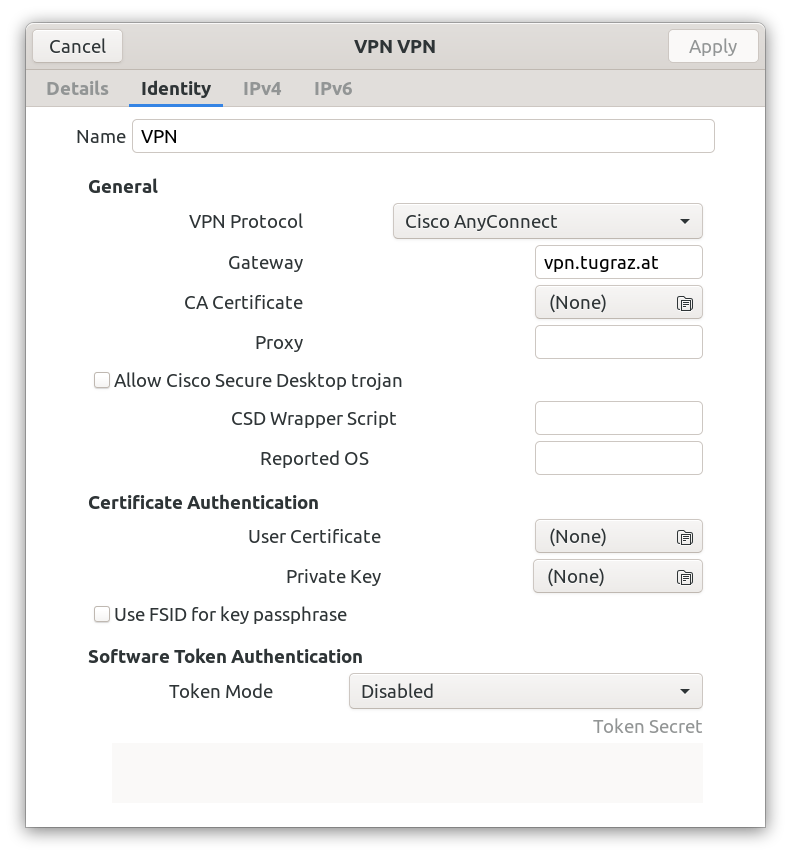
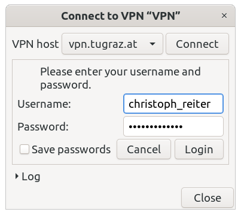

# TU Graz VPN Setup

Some of our internal services require you be connected via our VPN. This page
shows you how to best set up a VPN connection on your machine/phone.

## Android (openconnect)

* Install <https://play.google.com/store/apps/details?id=com.cisco.anyconnect.vpn.android.avf>
* Server Address: `vpn.tugraz.at`
* Username: `<tug-username>`
* Password: `<eduroam-password>`

{: style="width:400px"}

{: style="width:400px"}

{: style="width:400px"}

## GNOME using VPNC (recommended)

`sudo apt install network-manager-vpnc network-manager-vpnc-gnome`

- Gateway: `vpn.tugraz.at`
- Username: `<tug-username>`
- Password: `<eduroam-password>`
- Group name: `default`
- Group password: `default`
- Domain: `a4x.tugraz.at`

{: style="width:400px"}

{: style="width:400px"}

{: style="width:400px"}

{: style="width:400px"}

## GNOME using OpenConnect (in case VPNC doesn't work)

`sudo apt install network-manager-openconnect network-manager-openconnect-gnome`

-   Gateway: `vpn.tugraz.at`
-   Username: `<tug-username>`
-   Password: `<eduroam-password>`

{: style="width:400px"}

{: style="width:400px"}

{: style="width:400px"}

## Routes

In case you don't want to route your whole network traffic via the VPN it is adviced
to setup some routes in your VPN client and ignore the automatically obtained routes.

These are route to the servers the dev team uses:

| Adress        | Netmask     | Gateway | Metric |
| ------------- | ----------- | ------- | ------ |
| 129.27.79.149 | 255.255.0.0 | 0.0.0.0 | 0      |
| 129.27.79.158 | 255.255.0.0 | 0.0.0.0 | 0      |
| 129.27.79.159 | 255.255.0.0 | 0.0.0.0 | 0      |
| 129.27.2.209  | 255.255.0.0 | 0.0.0.0 | 0      |
