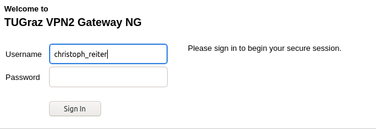
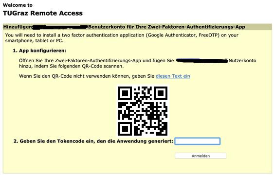
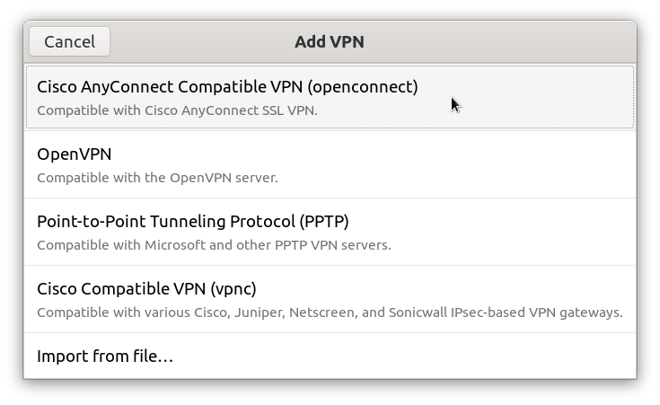
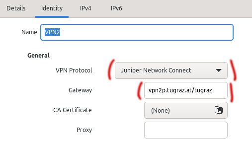
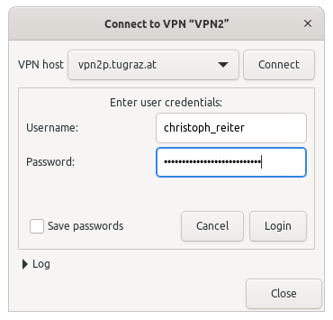
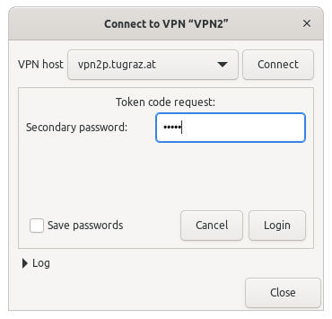

# vpn2p.tugraz.at

Some of our even more internal services are only reachable via a separate VPN
and 2FA.

## GNOME using OpenConnect 

### Install a TOTP app on your phone

For example andOTP:

* https://f-droid.org/en/packages/org.shadowice.flocke.andotp
* https://play.google.com/store/apps/details?id=org.shadowice.flocke.andotp

### Fetch the OTP key into your app

* Visit https://vpn2p.tugraz.at/tugraz
* Enter your
  * `<tug-username>`
  * `<eduroam-password>`

  {: style="width:400px"}

* Scan the QR code with your app

  {: style="width:400px"}

### Set up the VPN connection in GNOME

`sudo apt install network-manager-openconnect network-manager-openconnect-gnome`

-   Gateway: `vpn2p.tugraz.at/tugraz`
-   Username: `<tug-username>`
-   Password: `<eduroam-password>`
-   VPN Protocol: `Juniper Network Connect`

{: style="width:400px"}

{: style="width:400px"}

## Enable the connection

{: style="width:400px"}

{: style="width:400px"}
